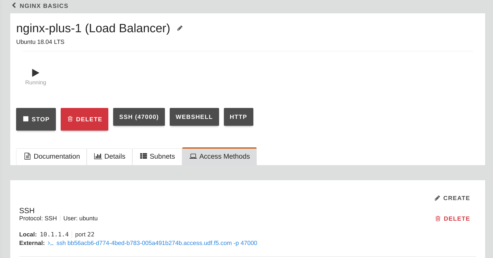
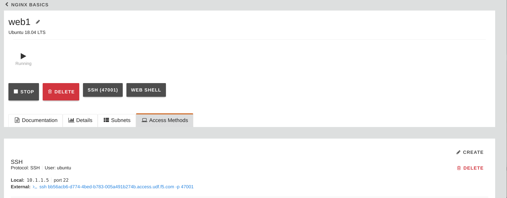

# NGINX-Basics

Implement NGINX Plus as an HTTP and HTTPS (SSL terminating) load balancer for two or more HTTP services

### Goals 

 * Provide a variety of NGINX Plus demonstrations
 * Provide examples of NGINX configurations best practices
 * Give you a feel for what it is like to work with NGINX Plus

## The Demo environement

This demo requires four docker containers for the NGINX demos: a NGINX Plus ADC/load balancer, `nginx-plus`, and 
webservers, `nginx1`, `nginx2` and `nginx3`:

An addtional container is used for the lab guide and is available on port 9000 

Details of the containers:

 * **NGINX Plus** `(Latest)` based on ubuntu 18.04 (and a sample centos 7 Dockerfile is provided). 
 * **NGINX OSS** `(Latest)` is based on [**nginx-hello**](https://github.com/nginxinc/NGINX-Demos/tree/master/nginx-hello). 
   NGINX webservers that serves a simple pages containing its hostname, IP address and port as wells as the request URI 
   and the local time of the webserver.
 * **Lab Guide** can be read from the [`docs/labs` folder](docs/labs/README.md) or in a web browser on [port 9000](http://localhost:9000). 

**Note:**[NGINX Plus Documentation](https://docs.nginx.com/nginx/), [resources](https://www.nginx.com/resources/) 
and [blog](https://www.nginx.com/blog/) are your best source of information for addtional technical information. There 
are many detailed examples found on the internet too!

### Topology

The base Docker Compose environment the lab is build on

```
                                             (nginx-hello upstream: nginx1:80, nginx2:80)
                      +---------------+                        
                      |               |       +-----------------+
+-------------------->|               |       |                 |
www.example.com       |               +------>|      nginx1     |
HTTP/Port 80          |               |       |  (nginx-hello)  |
                      |               |       |                 |
                      |               |       +-----------------+
+-------------------->|               |
www2.example.com      |               |       +-----------------+
HTTP-HTTPS redirect   |  nginx-plus   |       |                 |
HTTP/Port 80          |     (ADC)     +------>|     nginx2      |                     
                      |               |       |  (nginx-hello)  |
+-------------------->|               |       |                 |
www2.example.com      |               |       +-----------------+
HTTPS/Port 443        |               |             
                      |               |       +-----------------+         
                      |               |       |                 |
                      |               +------>|     nginx3      | 
                      |               |       |  (nginx-hello)  |
                      |               |       |                 |
                      |               |       +-----------------+
                      |               |
                      |               |       (dynamic upstream - empty)
+-------------------->|               |       +-----------------+         
NGINX Dashboard/      |               |       |                 |
API                   |               +------>|                 |
HTTP/Port 8080        |               |       |        *        |
                      |               |       |                 |
                      |               |       +-----------------+
                      +---------------+                                                                                    

                                              +-----------------+         
                                              |                 |
                                              |      docs       |
+-------------------------------------------->|   (lab guide)   |
LAB GUIDE                                     |                 |
HTTP/PORT 90                                  |                 |
                                              +-----------------+

```

## File Structure

```
/
├── etc/
│    ├── nginx/
│    │    ├── conf.d/ # ADD your HTTP/S configurations here
│    │    │   ├── example.com.conf............HTTP www.example.com Virtual Server configuration
│    │    │   ├── www2.example.com.conf.......HTTPS www2.example.com Virtual Server configuration
│    │    │   ├── upstreams.conf..............Upstream configurations
│    │    │   ├── stub_status.conf............NGINX Open Source basic status information available http://localhost/nginx_status only
│    │    │   └── status_api.conf.............NGINX Plus Live Activity Monitoring available on port 8080 - [Source](https://gist.github.com/nginx-gists/│a51 341a11ff1cf4e94ac359b67f1c4ae)
│    │    ├── includes
│    │    │    ├── add_headers/ # Headers to attach to client response
│    │    │    │   └── security.conf_ ........Recommended response headers for security
│    │    │    ├── error_pages/ # Custom Error Pages
│    │    │    │   ├── error_pages.conf.......NGINX configurations for custom error pages
│    │    │    │   ├── http403.conf_ .........Example HTTP 403 custom error pages
│    │    │    │   └── http404.conf_ .........Example HTTP 404 custom error pages
│    │    │    ├── log_formats/ # Custom extended log formats
│    │    │    │   ├── ext_log_formats.conf...Example custom log formats
│    │    │    │   └── json_log_formats.conf..Example JSON custom log formats
│    │    │    ├── proxy_cache/ # Proxy cache configurations
│    │    │    │   └── image_cache.conf_ .....Example proxy cache configurations for static web content e.g. Images
│    │    │    ├── proxy_headers/ # Headers to attach to upstream request
│    │    │    │   ├── keepalive.conf.........Recommended HTTP keepalives headers for performance
│    │    │    │   └── proxy_headers.conf.....Recommended request headers for request routing and logging
│    │    │    └── ssl # TLS Configurations examples
│    │    │        ├── ssl_intermediate.conf..Recommended SSL configuration for General-purpose servers with a variety of clients, recommended for almost all systems
│    │    │        ├── ssl_a+_strong.conf.....Recommended SSL configuration for Based on SSL Labs A+ (https://www.ssllabs.com/ssltest/)
│    │    │        ├── ssl_modern.conf........Recommended SSL configuration for Modern clients: TLS 1.3 and don't need backward compatibility
│    │    │        └── ssl_old.conf...........SSL configuration for compatiblity ith a number of very old clients, and should be used only as a last resort
│    │    ├── stream.conf.d/ # TODO: ADD your TCP and UDP Stream configurations here
│    │    └── nginx.conf .....................Main NGINX configuration file with global settings
│    └── ssl/
│          ├── nginx/ # NGINX Plus licenses
│          │   ├── nginx-repo.crt.............NGINX Plus repository certificate file (Use your evaluation crt file)
│          │   └── nginx-repo.key.............NGINX Plus repository key file (Use your evaluation key file)
|          ├── dhparam/ # Diffie–Hellman (DH) key exchange files
|          │    ├── 2048
|          │    │    └──nginx-repo.crt........2048 bit DH parameters
|          │    └── 4096
|          │        └──nginx-repo.crt.........4096 bit DH parameters
│          ├── example.com.crt................Self-signed wildcard certifcate for testing (*.example.com)
│          └── example.com.key................Self-signed private key for testing
└── var/
     ├── cache/
     │    └── nginx/ # Designated path for storing cached content
     └── lib/
          └── nginx/
               └── state/ # The recommended path for storing state files on Linux distributions
```

## Prerequisites:

1. NGINX evaluation license file. You can get it from [here](https://www.nginx.com/free-trial-request/)

2. A Docker host. With [Docker](https://docs.docker.com/get-docker/) and [Docker Compose](https://docs.docker.com/compose/install/)

3. **Optional**: The demo uses hostnames: `www.example.com` and `www2.example.com`. For host name resolution you will need to add hostname bindings to your hosts file:

For example on Linux/Unix/MacOS the host file is `/etc/hosts`

```bash
# NGINX Plus demo system (local docker host)
127.0.0.1 example.com www.example.com www2.example.com nginx-plus-1
```

> **Note:**
> DNS resolution between containers is provided by default using a new bridged network by docker networking and
> NGINX has been preconfigured to use the Docker DNS server (127.0.0.11) to provide DNS resolution between NGINX and
> upstream servers

## Build and run the demo environment

Provided the Prerequisites have been met before running the stpes below, this is a **working** environment. 

### Build the demo

In this demo we will have a one NGINX Plus ADC/load balancer (`nginx-plus`) and three NGINX OSS webserver (`web1`, `web2` and `web3`)

Before we can start, we need to copy our NGINX Plus repo key and certificate (`nginx-repo.key` and `nginx-repo.crt`) into the directory, `nginx-plus/etc/ssl/nginx/`, then build our stack:

```bash
# Enter working directory
cd nginx-basics

# Make sure your Nginx Plus repo key and certificate exist here
ls nginx-plus/etc/ssl/nginx/nginx-*
nginx-repo.crt              nginx-repo.key

# Downloaded docker images and build
docker-compose pull
docker-compose build --no-cache
```

-----------------------
> See other other useful [`docker`](docs/useful-docker-commands.md) and [`docker-compose`](docs/useful-docker-compose-commands.md) commands
-----------------------

#### Start the Demo stack:

Run `docker-compose` in the foreground so we can see real-time log output to the terminal:

```bash
docker-compose up
```

Or, if you made changes to any of the Docker containers or NGINX configurations, run:

```bash
# Recreate containers and start demo
docker-compose up --force-recreate
```

**Confirm** the containers are running. You should see three containers running:

```bash
docker ps
CONTAINER ID        IMAGE                     COMMAND                  CREATED             STATUS              PORTS                                                              NAMES
628c0023a2f1        nginx-basics_nginx-plus   "nginx -g 'daemon of…"   3 hours ago         Up 3 hours          0.0.0.0:80->80/tcp, 0.0.0.0:443->443/tcp, 0.0.0.0:8080->8080/tcp   nginx-basics_nginx-plus_1
1098430ff17e        nginx-basics_web1         "/docker-entrypoint.…"   3 hours ago         Up 3 hours          80/tcp                                                             nginx-basics_web1_1
d93186c51110        nginx-basics_web2         "/docker-entrypoint.…"   3 hours ago         Up 3 hours          0.0.0.0:1052->80/tcp                                               nginx-basics_web2_1
0543c12c0613        nginx-basics_web3         "/docker-entrypoint.…"   3 hours ago         Up 3 hours          0.0.0.0:1053->80/tcp                                               nginx-basics_web3_
```

The demo environment is ready in seconds. You can access the `nginx-hello` demo website on **HTTP / Port 80** 
([`http://localhost`](http://localhost) or [http://www.example.com](http://example.com)) and on **HTTPS / Port 443**
([https://www2.example.com](http://example.com)). 

The NGINX API is available on **HTTP / Port 8080** ([`http://localhost:8080`](http://localhost)) or [http://www.example.com:8080](http://example.com:8080))


#### Upload to UDF

This demo system can also be ported to UDF

1. Get the UDF Address (URL and Port) for the target NGINX Plus Load Balancer Instance



2. `scp` the NGINX Plus Load Balancer configurations: 

```bash
# Enter working directory
cd nginx-basics
# Set variables
USER=ubuntu
HOST=bb56acb6-d774-4bed-b783-005a491b274b.access.udf.f5.com
PORT=47000
DATE_WITH_TIME=`date "+%Y%m%d-%H%M%S"`
# Push local nginx plus config to remote server while making backup first
ssh -p $PORT $USER@$HOST "sudo cp -r /etc/nginx /var/tmp/nginx-$DATE_WITH_TIME"
ssh -p $PORT $USER@$HOST "sudo rm -rf /var/tmp/nginx-new"
scp -r -P $PORT nginx-plus/etc/nginx $USER@$HOST:/var/tmp/nginx-new 
ssh -p $PORT $USER@$HOST "sudo rsync -Prtv --exclude modules/ --delete /var/tmp/nginx-new/* /etc/nginx"
ssh -p $PORT $USER@$HOST "sudo chown -R nginx:nginx /etc/nginx"
```

3. Get the UDF Address (URL and Port) for the target Web Server NGINX Instance



4. `scp` the NGINX web server configuration: 

```bash
# Set variables
USER=ubuntu
HOST=bb56acb6-d774-4bed-b783-005a491b274b.access.udf.f5.com
PORT=47001
DATE_WITH_TIME=`date "+%Y%m%d-%H%M%S"`
# Push local nginx web server config to remote server while making backup first
ssh -p $PORT $USER@$HOST "sudo cp -r /etc/nginx /var/tmp/nginx-$DATE_WITH_TIME"
ssh -p $PORT $USER@$HOST "sudo rm -rf /var/tmp/nginx-new"
scp -r -P $PORT nginx-hello/etc/nginx $USER@$HOST:/var/tmp/nginx-new 
# Copy Lab guide config
scp -r -P $PORT docs/misc/lab_guide.conf $USER@$HOST:/var/tmp/nginx-new/conf.d 
ssh -p $PORT $USER@$HOST "sudo rsync -Prtv --exclude modules/ --delete /var/tmp/nginx-new/* /etc/nginx"
ssh -p $PORT $USER@$HOST "sudo chown -R nginx:nginx /etc/nginx"
# Push local web to remote server while making backup first
ssh -p $PORT $USER@$HOST "sudo cp -r /usr/share/nginx/html /var/tmp/nginx-html-$DATE_WITH_TIME"
ssh -p $PORT $USER@$HOST "sudo rm -rf /var/tmp/nginx-new-html"
scp -r -P $PORT nginx-hello/usr/share/nginx/html $USER@$HOST:/var/tmp/nginx-new-html 
# Copy Lab guide
scp -r -P $PORT docs/labs $USER@$HOST:/var/tmp/nginx-new-html 
ssh -p $PORT $USER@$HOST "sudo rsync -Prtv --delete /var/tmp/nginx-new-html/* /usr/share/nginx/html"
# Sync to other Web servers (if you have others configured with nginx-sync.sh)
# Note: If there is a incorrect host in /root/.ssh/known_hosts, you may need to 
# run the nginx-sync.sh command on the server, not remotely:
ssh -p $PORT $USER@$HOST "sudo nginx-sync.sh"
```

Example `nginx-sync.conf` on the web server:

```bash
NODES="web2 web3"
CONFPATHS="/etc/nginx /etc/ssl /usr/share/nginx/html"
#EXCLUDE="default.conf"
```