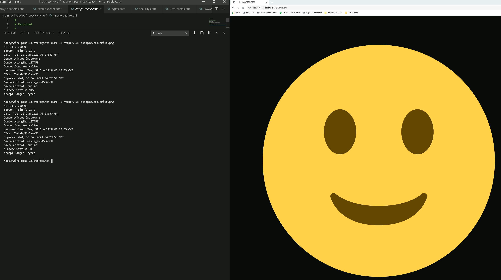
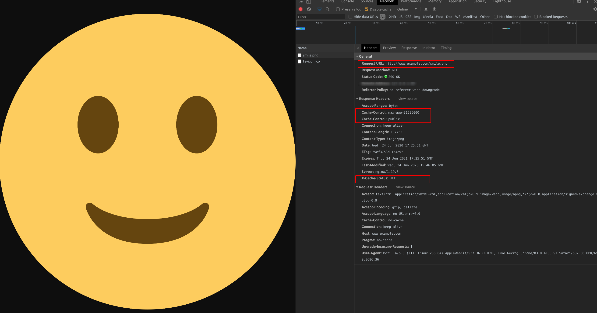

# Cache Proxy

## Introduction

One of the most popular use cases for NGINX Plus is as a content cache. The NGINX content cache sits in between a client 
and an "Origin server", commonly deployed as a reverse proxy or load balancer in an application stack to both to 
accelerate local origin servers and to create edge servers for content delivery networks (CDNs). Caching can reduce the 
load on your origin servers by a huge factor, depending on the cacheability of your content and the profile of user traffic.

**References:** 
 * [NGINX Content Caching](https://docs.nginx.com/nginx/admin-guide/content-cache/content-caching)
 * [NGINX caching Guide](https://www.nginx.com/blog/nginx-caching-guide/)

## Learning Objectives 

By the end of the lab you will be able to: 

 * Configure a basic Proxy Cache
 * Visualize cache status on the live activity monitoring dashboard
 * Add a custom HTTP header to upstream cache status
 * Purge cached objects using the Cache Purge API

## Exercise 1: Cache proxy for web content

 1. In the `WORKSPACE` folder found on the desktop, open `NGINX-PLUS-1.code-workspace` in Visual Studio Code (VSCode)


 2. In the VSCode, open a a **terminal window**, using `View > Terminal menu` command. You will now be able to both run 
   NGINX commands and edit NGINX Plus configuration files via the VSCode Console and terminal. (SSH access via Putty is 
   also available as a SSH remote terminal access option.)


 3. Inspect `/etc/nginx/conf.d/proxy_cache_global.conf` and inspect the proxy caches configured on NGINX

```nginx

# /etc/nginx/conf.d/proxy_cache_global.conf

#
# Cache proxies
#
proxy_cache_path /var/cache/nginx
                levels=1:2
                keys_zone=image_cache:10m
                max_size=100m
                inactive=60m
                use_temp_path=off;
```

 4. Now, inspect `/etc/nginx/conf.d/example.com.conf` and note the following:

 * The `location` block matching image file extentions where we have enabled our cache proxy "`image_cache`"
 * We have put all specific cache settings for image files in its own configuration file called `image_cache.conf`

```nginx 
# /etc/nginx/conf.d/example.com.conf

    # Cache Proxy example for images only
    # Match common Image files
    location ~* \.(?:jpg|jpeg|gif|png|ico|cur|gz|svg|svgz|mp4|ogg|ogv|webp|webm|htc)$ {

        ## Proxy cache settings
        include includes/proxy_cache/image_cache.conf;
        
        # etc

    }
```

 5. Now, inspect `/etc/nginx/includes/proxy_cache/image_cache.conf` and note the following:


```nginx 

# /etc/nginx/includes/proxy_cache/image_cache.conf

#
# Required
#
proxy_cache image_cache;

#
# Extra
#
# Set caching time for different response codes
proxy_cache_valid 200 1h;
proxy_cache_valid 301 302 10m;
proxy_cache_valid 404 1m;
proxy_cache_valid any 10s;

# Override cache headers
proxy_ignore_headers X-Accel-Expires Expires Cache-Control Set-Cookie;
expires 365d;
add_header Cache-Control "public";

# Cache status
add_header X-Cache-Status $upstream_cache_status;

# Enable Cache Purge API here
proxy_cache_purge $purge_method;

# etc...
```

 6. Lets see our cache proxy in action. In the Terminal window, request `smile.png` using a Web Browser or `curl`. 
    We will see that the **inital request** is served from the origin server as it is not cached on NGINX yet

```bash
curl -I http://www.example.com/smile.png

HTTP/1.1 200 OK
Server: nginx/1.19.0
Date: Wed, 24 Jun 2020 17:45:16 GMT
Content-Type: image/png
Content-Length: 107753
Connection: keep-alive
Last-Modified: Wed, 24 Jun 2020 15:46:05 GMT
ETag: "5ef3753d-1a4e9"
Expires: Thu, 24 Jun 2021 17:45:16 GMT
Cache-Control: max-age=31536000 # <-- Cache-Control Override for a year
X-Cache-Status: MISS # <-- Inital hit served from Origin server
Cache-Control: public # <-- Cache-Control Override to public
Accept-Ranges: bytes
```

 7. Request `smile.png` again, using a web browser or `curl`. 
   We will see that the **subsequent requests** are served from the origin server as it is not cached on NGINX yet


```bash
curl -I http://www.example.com/smile.png

HTTP/1.1 200 OK
Server: nginx/1.19.0
Date: Wed, 24 Jun 20V20 17:29:43 GMT
Content-Type: image/png
Content-Length: 107753
Connection: keep-alive
Last-Modified: Wed, 24 Jun 2020 15:46:05 GMT
ETag: "5ef3753d-1a4e9"
Expires: Thu, 24 Jun 2021 17:29:43 GMT
Cache-Control: max-age=31536000 # <-- Cache-Control Override for a year
X-Cache-Status: HIT # <-- Subsequent requests served from Proxy cache
Cache-Control: public # <-- Cache-Control Override to public
Accept-Ranges: bytes
```



 8. Alternatively, using Chrome developer tools, we can see those HTTP headers.

   When you want to inspect a the web pages Network Activity: **right-click** on the webpage and select **Inspect**
   to open the Chrome DevTools > select the **Network tab** > Check **Disable Cache** > Reload the webpage >
   (the webpage and webpage content wil reload) > find the web content to inspect (e.g. `smile.png`) > Look at the
   **Headers** tab for **Reponse Headers** and **Request Headers**

   When inspecting the response headers in Chrome DevTools, you will see the HTTP headers we saw using `curl`




## Exercise 2: Visualize cache status on the live activity monitoring dashboard

 1. In a Web Browser, we can visualize cache status on the live activity monitoring dashboard: Navigate to out NGINX Plus dashboard on
   [www.example.com:8080](http://www.example.com:8080) > **Caches**. 

   The Cache Hit Ratio shown for the zone, `image_cache` will increase as we repeatedly request cached content.

 2. On another tab in your Web Browser, navigate to [www.example.com/img/test.html](http://www.example.com/img/test.html) 
   to load images served from the NGINX cache. Hit the Web Browser's refresh button multiple times to simulate multiple
   requests


 3. Alternatively you can copy, paste and execute the `curl` commands below multiple times in your terminal

```bash
# Copy and paste these lines into your terminal multiple times
curl -s -I http://www.example.com/img/500x500.gif | grep "X-Cache-Status:"
curl -s -I http://www.example.com/img/500x500.jpg | grep "X-Cache-Status:"
curl -s -I http://www.example.com/img/500x500.webp | grep "X-Cache-Status:"
curl -s -I http://www.example.com/img/1000x1000.gif | grep "X-Cache-Status:"
curl -s -I http://www.example.com/img/1000x1000.jpg | grep "X-Cache-Status:"
curl -s -I http://www.example.com/img/1000x1000.png | grep "X-Cache-Status:"
curl -s -I http://www.example.com/img/1000x1000.webp | grep "X-Cache-Status:"
curl -s -I http://www.example.com/img/picture.gif | grep "X-Cache-Status:"
curl -s -I http://www.example.com/img/picture.jpg | grep "X-Cache-Status:"
curl -s -I http://www.example.com/img/picture.png | grep "X-Cache-Status:"
curl -s -I http://www.example.com/img/picture.webp | grep "X-Cache-Status:"

X-Cache-Status: HIT
X-Cache-Status: HIT
X-Cache-Status: HIT
X-Cache-Status: HIT
X-Cache-Status: HIT
X-Cache-Status: HIT
X-Cache-Status: HIT
X-Cache-Status: HIT
X-Cache-Status: HIT
X-Cache-Status: HIT
X-Cache-Status: HIT
```

 4. You will see the Cache Hit Ratio increase as most of your requests are now served from the NGINX cache, eliminating the
   the need for requests to your Origin Servers

   

## Exercise 3: Restricting Access to the Purge Command and using Cache purge API

 1. Inspect `/etc/nginx/conf.d/proxy_cache_global.conf` again, and find the `geo` and `map` blocks that identifies requests that use the
   HTTP `PURGE` method and deletes objects in the cache matching those URLs.

  * The `geo` block sets a custom variable, `$purge_allowed`, to `1` only on select client IP addresses
  * The `map` block sets another custom variable, `$purge_method` to the value of `$purge_allowed` (`0` or `1`)

  In this example, NGINX checks if the `PURGE` method is used in a request, and, if so, analyzes the client IP address. 
  If the IP address is whitelisted, then the `$purge_method` is set to `$purge_allowed`: `1` permits purging, and `0` 
  denies it.

```nginx
# /etc/nginx/conf.d/proxy_cache_global.conf

# Trimmed...

# Use geo to allow specific subnets to access purge API. 
# $purge_allowed is set 1 when request is made from allowed-listed IP
    geo $purge_allowed {
      127.0.0.1     1; # allow from localhost
      172.19.0.0/24 1; # allow a private subnet
      10.1.1.9      1; # allow from selected IP i.e jumphost
      default       0; # deny from other
    }
  
  # $request_method is set to the value of $purge_allowed (0 or 1)
  # depending if the Client iP is on the allowed-list or deny-list
  
  map $request_method $purge_method {
    PURGE $purge_allowed; 
    default 0;
  }
```

 2. Inspect `example.com.conf`, and find in the main location block `/` we have enabled cache purge calls here when 
   `$purge_method` exists (`1`)

```nginx
# /etc/nginx/conf.d/example.conf

location / {

   # Enable Cache Purge API here
   # Note: No cache rules, just allow purge on all other '/' URLs
   proxy_cache image_cache;
   proxy_cache_purge $purge_method;

   # etc..
}
```

 3. Lets see our cache purge API in action: In the Terminal window, make a `curl` request to purge a single object,`smile.png` 
   using the HTTP method `PURGE`. Note that the expected reponse code for a successful purge is a `HTTP 204` 

```bash

# First make sure the test image is in the cache:
curl -I http://www.example.com/smile.png

# Now, we can Purge that specific object from the cache
curl -I -X PURGE -D – "http://www.example.com/smile.png"

HTTP/1.1 204 No Content
Server: nginx/1.19.0
Date: Thu, 25 Jun 2020 17:09:26 GMT
Connection: keep-alive
Expires: Fri, 25 Jun 2021 17:09:26 GMT
Cache-Control: max-age=31536000
Cache-Control: public
```

 4. We can also do a wild card purge using `*` in our URL.  First, in a Web Browser, navigate to [www.example.com/img/test.html](http://www.example.com/img/test.html) and make sure our test images are in the cache


 5. Lets confirm all the images are in the cache:

```bash
# Copy and paste these lines into your terminal
curl -s -I http://www.example.com/img/500x500.gif | grep "X-Cache-Status:"
curl -s -I http://www.example.com/img/500x500.jpg | grep "X-Cache-Status:"
curl -s -I http://www.example.com/img/500x500.webp | grep "X-Cache-Status:"
curl -s -I http://www.example.com/img/1000x1000.gif | grep "X-Cache-Status:"
curl -s -I http://www.example.com/img/1000x1000.jpg | grep "X-Cache-Status:"
curl -s -I http://www.example.com/img/1000x1000.png | grep "X-Cache-Status:"
curl -s -I http://www.example.com/img/1000x1000.webp | grep "X-Cache-Status:"
curl -s -I http://www.example.com/img/picture.gif | grep "X-Cache-Status:"
curl -s -I http://www.example.com/img/picture.jpg | grep "X-Cache-Status:"
curl -s -I http://www.example.com/img/picture.png | grep "X-Cache-Status:"
curl -s -I http://www.example.com/img/picture.webp | grep "X-Cache-Status:"

X-Cache-Status: HIT
X-Cache-Status: HIT
X-Cache-Status: HIT
X-Cache-Status: HIT
X-Cache-Status: HIT
X-Cache-Status: HIT
X-Cache-Status: HIT
X-Cache-Status: HIT
X-Cache-Status: HIT
X-Cache-Status: HIT
X-Cache-Status: HIT
```

 6. Now we can do a wildcard cache purge

```bash
# Wildcard Purge all objects in the URL path prefix e.g. /img/
curl -I -X PURGE "http://www.example.com/img/*"
# Wildcard Purge everything i.e. all objects in the '/' URL path prefix 
curl -I -X PURGE "http://www.example.com/*"
```

 7. Lets confirm wildcard cache purge has evicted all out cached images.The next request for these images should serve the
   image from the Origin Servers, as it is not available in the NGINX cache yet.


```bash
# Copy and paste these lines into your terminal
curl -s -I http://www.example.com/img/500x500.gif | grep "X-Cache-Status:"
curl -s -I http://www.example.com/img/500x500.jpg | grep "X-Cache-Status:"
curl -s -I http://www.example.com/img/500x500.webp | grep "X-Cache-Status:"
curl -s -I http://www.example.com/img/1000x1000.gif | grep "X-Cache-Status:"
curl -s -I http://www.example.com/img/1000x1000.jpg | grep "X-Cache-Status:"
curl -s -I http://www.example.com/img/1000x1000.png | grep "X-Cache-Status:"
curl -s -I http://www.example.com/img/1000x1000.webp | grep "X-Cache-Status:"
curl -s -I http://www.example.com/img/picture.gif | grep "X-Cache-Status:"
curl -s -I http://www.example.com/img/picture.jpg | grep "X-Cache-Status:"
curl -s -I http://www.example.com/img/picture.png | grep "X-Cache-Status:"
curl -s -I http://www.example.com/img/picture.webp | grep "X-Cache-Status:"

X-Cache-Status: MISS
X-Cache-Status: MISS
X-Cache-Status: MISS
X-Cache-Status: MISS
X-Cache-Status: MISS
X-Cache-Status: MISS
X-Cache-Status: MISS
X-Cache-Status: MISS
X-Cache-Status: MISS
X-Cache-Status: MISS
X-Cache-Status: MISS
```