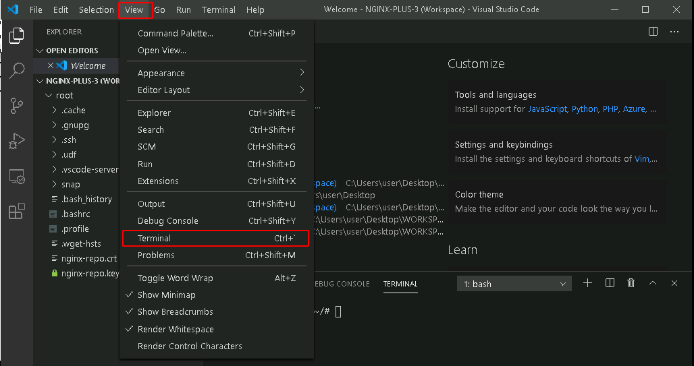
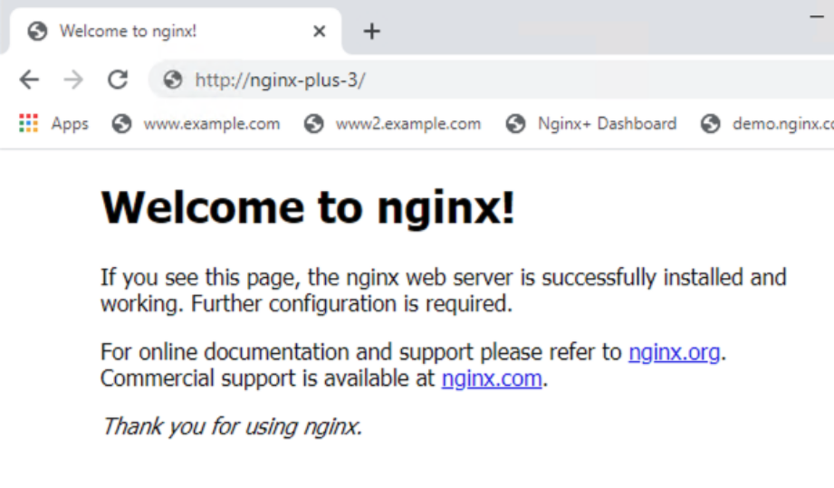
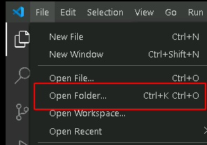
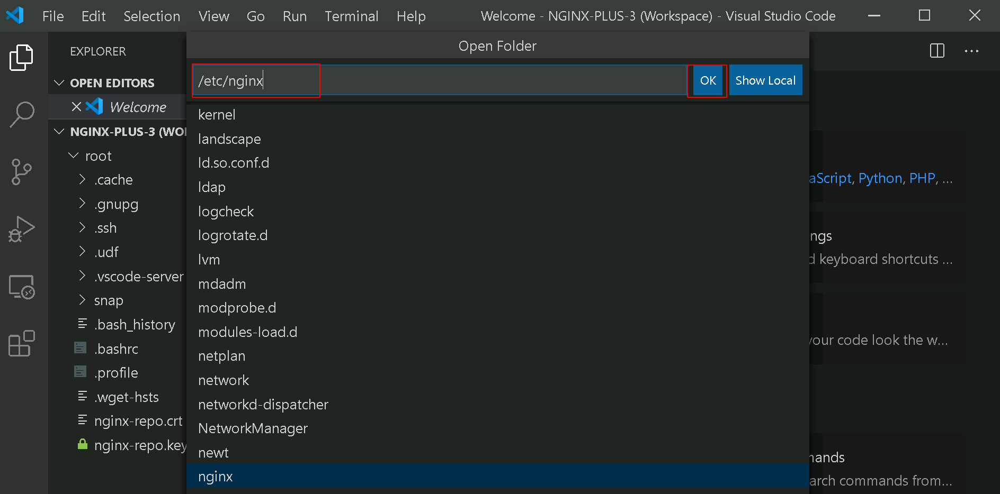
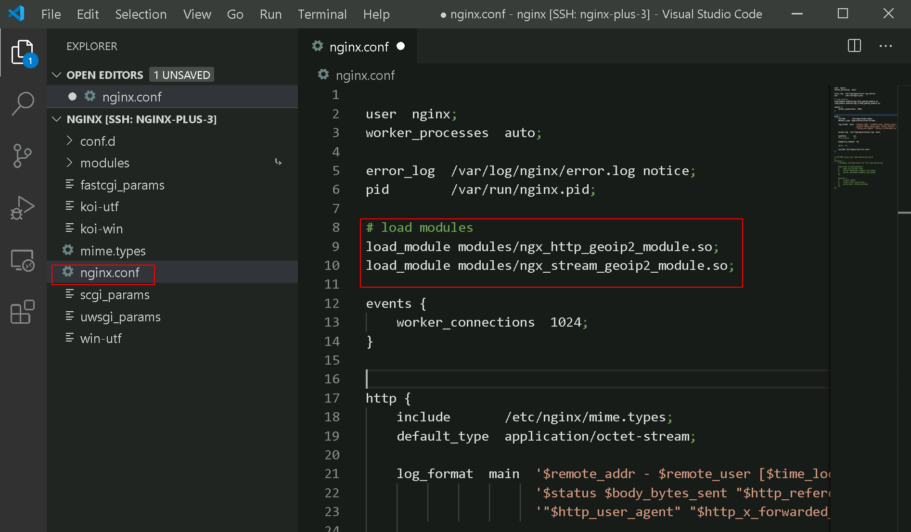
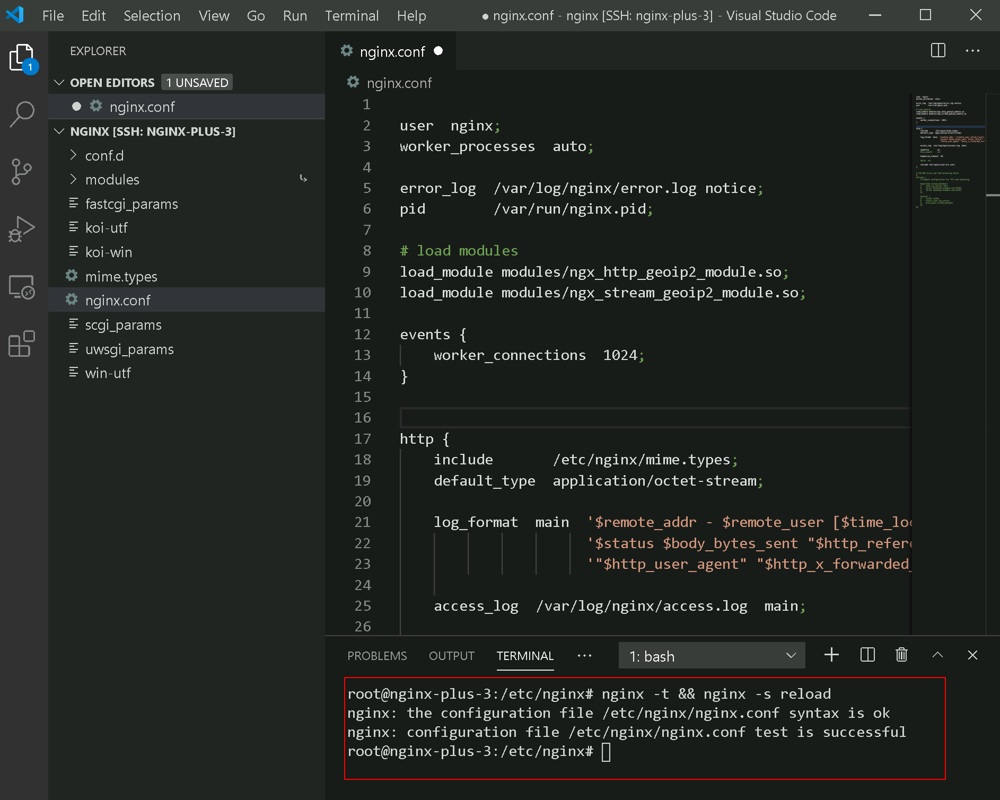

# Installing NGINX Plus 

## Introduction

NGINX Plus is supported on Amazon Linux, CentOS, Debian, FreeBSD, Oracle Linux, Red Hat Enterprise Linux (RHEL), SUSE Linux Enterprise Server (SLES), and Ubuntu.

For Sizing guidance for Deploying NGINX Plus, see [Sizing Guide for Deploying NGINX Plus on Bare Metal Servers](https://www.nginx.com/resources/datasheets/nginx-plus-sizing-guide/)

**Prerequisites**
 * An NGINX Plus subscription (purchased or trial)
 * A supported operating system
 * root privilege
 * Your credentials to the NGINX Plus Customer Portal, provided by email from NGINX, Inc.
 * Your NGINX Plus certificate and public key (`nginx-repo.crt` and `nginx-repo.key` files), provided by email from NGINX, Inc.

**References:** 
 * [Installing NGINX Plus](https://docs.nginx.com/nginx/admin-guide/installing-nginx/installing-nginx-plus/)
 * [GeoIP2 Module](https://docs.nginx.com/nginx/admin-guide/dynamic-modules/geoip2/)

## Learning Objectives 

By the end of the lab you will be able to: 

 * Install NGINX Plus 
 * Install a NGINX Plus Dynamic Module
 * Verify Installation 
 * Invoke NGINX and common options from from the command line

## Exercise 1: Install NGINX Plus 

1. In the `WORKSPACE` folder found on the desktop, open `NGINX-PLUS-3.code-workspace` in Visual      Studio Code (VSCode)
   
   If are prompted **Are you sure you want to continue?**, select **continue**


2. In the VSCode, open a a **terminal window**, using `View > Terminal menu` command. You will now be able to both run 
   NGINX commands and edit NGINX Plus configuration files via the VSCode Console and terminal. (SSH access via Putty is 
   also available as a SSH remote terminal access option.)





3. In the terminal run the following commands to install NGINX Plus 

```bash
# Confirm you are root
whoami
root

# Move to the /root directory and check nginx-repo cert and key are here
cd /root 
ls
nginx-repo.crt  nginx-repo.key

# Run installation commands
mkdir -p /etc/ssl/nginx 
cp nginx-repo.* /etc/ssl/nginx 
wget http://nginx.org/keys/nginx_signing.key && sudo apt-key add nginx_signing.key 
apt-get install apt-transport-https lsb-release ca-certificates 
printf "deb https://plus-pkgs.nginx.com/ubuntu `lsb_release -cs` nginx-plus\n" | sudo tee /etc/apt/sources.list.d/nginx-plus.list 
wget -P /etc/apt/apt.conf.d https://cs.nginx.com/static/files/90nginx 
apt-get update 
apt-get -y install nginx-plus 
```

4. Verify the version of NGINX Plus that was installed: 

```bash
nginx -v 
```

5. Install the NGINX Plus GeoIP2 Dynamic Module

```bash
apt-get -y install nginx-plus-module-geoip2 

Reading package lists... Done 
Building dependency tree        
Reading state information... Done 

The following additional packages will be installed: 

  libmaxminddb0 

Suggested packages: 

  mmdb-bin 

The following NEW packages will be installed: 

  libmaxminddb0 nginx-plus-module-geoip2 

0 upgraded, 2 newly installed, 0 to remove and 9 not upgraded. 
Need to get 37.6 kB of archives. 
After this operation, 138 kB of additional disk space will be used. 
Do you want to continue? [Y/n] Y 
Get:1 http://us-west-2.ec2.archive.ubuntu.com/ubuntu bionic/universe amd64 libmaxminddb0 amd64 1.3.1-1 [25.6 kB] 
Get:2 https://plus-pkgs.nginx.com/ubuntu bionic/nginx-plus amd64 nginx-plus-module-geoip2 amd64 22+3.3-1~bionic [12.0 kB] 
Fetched 37.6 kB in 1s (54.7 kB/s)                      
Selecting previously unselected package libmaxminddb0:amd64. 
(Reading database ... 56711 files and directories currently installed.) 
Preparing to unpack .../libmaxminddb0_1.3.1-1_amd64.deb ... 
Unpacking libmaxminddb0:amd64 (1.3.1-1) ... 
Selecting previously unselected package nginx-plus-module-geoip2. 
Preparing to unpack .../nginx-plus-module-geoip2_22+3.3-1~bionic_amd64.deb ... 
Unpacking nginx-plus-module-geoip2 (22+3.3-1~bionic) ... 
Setting up libmaxminddb0:amd64 (1.3.1-1) ... 
Setting up nginx-plus-module-geoip2 (22+3.3-1~bionic) ... 

---------------------------------------------------------------------- 

The 3rd-party GeoIP2 dynamic modules for NGINX Plus have been installed. 
To enable these modules, add the following to /etc/nginx/nginx.conf 
and reload nginx: 

    load_module modules/ngx_http_geoip2_module.so; 
    load_module modules/ngx_stream_geoip2_module.so; 

Please refer to the module documentation for further details: 
https://github.com/leev/ngx_http_geoip2_module 

---------------------------------------------------------------------- 
Processing triggers for man-db (2.8.3-2ubuntu0.1) ... 
Processing triggers for libc-bin (2.27-3ubuntu1) ... 
```

6. Start NGINX Plus
 
```bash
systemctl start nginx 
```

7.  Verify that NGINX Plus has started

```
ps -eaf | grep nginx 

root      5532     1  0 19:35 ?        00:00:00 nginx: master process /usr/sbin/nginx -c /etc/nginx/nginx.conf 
nginx     5534  5532  0 19:35 ?        00:00:00 nginx: worker process 
root      5541  4062  0 19:35 pts/1    00:00:00 grep --color=auto nginx 
```

8. Test the NGINX Plus instance in your browser. Open **Google Chrome** from your Desktop and enter the following URL, 
   [http://nginx-plus-3](http://nginx-plus-3). You should see the NGINX default page:




## Exercise 2: NGINX Plus command line basics

In this exercise, we will review configure NGINX Plus as a basic load balancer and test/verify configured functionality.   

1. If you have closed VSCode, once again, open `NGINX-PLUS-3code-workspace` found in the he `WORKSPACE` folder, on the desktop,
   in VSCode


2. In the VSCode, open a a **terminal window**, using `View > Terminal menu` command. You will now be able to both run 
   NGINX commands and edit NGINX Plus configuration files via the VSCode Console and terminal. (SSH access via Putty is 
   also available as a SSH remote terminal access option.)

3. In the terminal run the following NGINX commands

```bash
#  Print help for command-line parameters.
nginx -h 
# Test the configuration file: nginx checks the configuration for correct syntax, 
# and then tries to open files referred in the configuration.
nginx -t 
# same as -t, but additionally dump configuration files to standard output
nginx -T 
# print nginx version
nginx -v
# print nginx version, compiler version, and configure parameters.
nginx -V 
send a signal to the master process. The argument signal can be one of:
# stop — shut down quickly
# quit — shut down gracefully
# reload — reload configuration, start the new worker process with a new
#          configuration, gracefully shut down old worker processes.
# reopen — reopen log files
nginx -s reload 
```

## Exercise 3: Inspect NGINX Plus modules

Now at NGINX Plus is installed, browse to the NGINX configuration root, `/etc/nginx`

1. `File > Open Folder...`



2. Enter `/etc/nginx` in the open folder menu



3. Select the `nginx.conf` file in the VSCode Explorer section. 

4. To enable the 3rd-party GeoIP2 dynamic modules for NGINX Plus that have been installed, add the following lines to 
   `/etc/nginx/nginx.conf` in the **main context** and **reload nginx**: 

```nginx
# load modules
load_module modules/ngx_http_geoip2_module.so; 
load_module modules/ngx_stream_geoip2_module.so;
```

For example it may look like this:



5. In the terminal window using `View > Terminal menu` command, and in the terminal, run the following commands to reload nginx:

```bash
nginx -t && nginx -s reload
```



6. See which Dynamic modules are installed: 

```bash
cd /etc/nginx/modules  
ls -al 
```