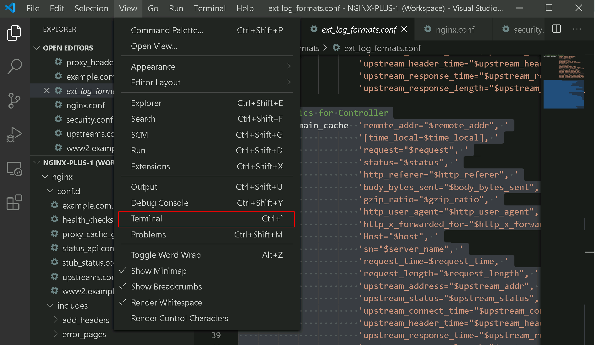
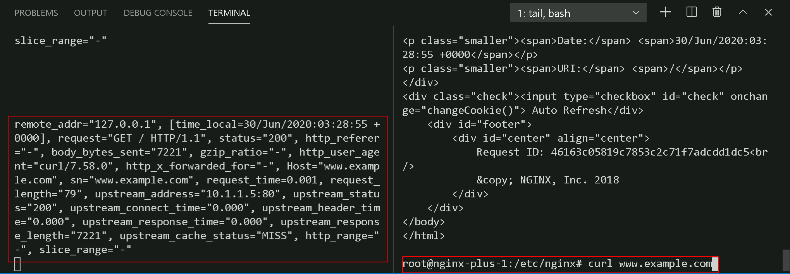

# Custom Access Logs

## Introduction

NGINX's logging facility is highly customizable and allows you to add custom [variables](http://nginx.org/en/docs/varindex.html)
into your logs for purposes of verbose debugging, troubleshooting or analysis of what unfolds within your applications served by NGINX

**References:** 

 * [Configuring Logging](https://docs.nginx.com/nginx/admin-guide/monitoring/logging)

## Learning Objectives 

By the end of the lab you will be able to: 

 * Configure [Access log](http://nginx.org/en/docs/http/ngx_http_log_module.html#access_log) using custom log formats
 * Configure Server specific Access logs and Error Logs

## Exercise 1: Enable virtual server specifc Error and Access logs for www.example.com

A best practice is to set up individual log files for each of your virtual servers in order to reduce the size of each 
log file, this makes troubleshooting easier and log rotation less frequent.


1. In the `WORKSPACE` folder found on the desktop, open `NGINX-PLUS-1` in Visual Studio Code (VSCode)

   

2. In the VSCode, open a a **terminal window**, using `View > Terminal menu` command. You will now be able to both run 
   NGINX commands and edit NGINX Plus configuration files via the VSCode Console and terminal. (SSH access via Putty is 
   also available as a SSH remote terminal access option.)

   

3. Now inspect the `/etc/nginx/conf.d/example.com.conf` file. Note the specific `access_log` and `error_log ` definitions
   in the server block. Access and Error logs are written into their own files:

   ```nginx
   # Server specific logging
   access_log  /var/log/nginx/www.example.com.log  main_cache; 
   error_log   /var/log/nginx/www.example.com_error.log notice; 
   ```

4. Now inspect the custom log format defined as `main_cache` in `/etc/nginx/includes/log_formats/ext_log_formats.conf`

   ```nginx
   # Cache metrics for Controller
   log_format  main_cache  'remote_addr="$remote_addr", '
                           '[time_local=$time_local], '
                           'request="$request", '
                           'status="$status", '
                           'http_referer="$http_referer", '
                           'body_bytes_sent="$body_bytes_sent", '
                           'gzip_ratio="$gzip_ratio", '
                           'http_user_agent="$http_user_agent", '
                           'http_x_forwarded_for="$http_x_forwarded_for", '
                           'Host="$host", '
                           'sn="$server_name", '
                           'request_time=$request_time, '
                           'request_length="$request_length", '
                           'upstream_address="$upstream_addr", '
                           'upstream_status="$upstream_status", '
                           'upstream_connect_time="$upstream_connect_time", '
                           'upstream_header_time="$upstream_header_time", '
                           'upstream_response_time="$upstream_response_time", '
                           'upstream_response_length="$upstream_response_length", '
                           'upstream_cache_status="$upstream_cache_status", '
                           'http_range="$http_range", '
                           'slice_range="$slice_range" ';
   ```

5. In the VSCode, open a a **terminal window**, using `View > Terminal menu` command. You will now be able to both run 
   NGINX commands and edit NGINX Plus configuration files via the VSCode Console and terminal. (SSH access via Putty is 
   also available as a SSH remote terminal access option.)

   

   

6. On the terminal, on the NGINX Plus server, use `tail` to output the access logs for`www.example.com` as they are written:

   ```bash
   tail -f /var/log/nginx/www.example.com.log
   ```

7. Run some traffic to [`http://www.example.com`](http://www.example.com) From a web browser, open another Terminal in 
   VSCode by selecting the **split terminal** icon on the right and run a `curl` command:

   ```bash 
      `curl http://www.example.com`
   ```

   

8. We now can see our custom access log written to file

   ```bash
   tail -f /var/log/nginx/www.example.com.log

   remote_addr="127.0.0.1", [time_local=30/Jun/2020:03:28:55 +0000], request="GET / HTTP/1.1", status="200", http_referer="-", body_bytes_sent="7221", gzip_ratio="-", http_user_agent="curl/7.58.0", http_x_forwarded_for="-", Host="www.example.com", sn="www.example.com", request_time=0.001, request_length="79", upstream_address="10.1.1.5:80", upstream_status="200", upstream_connect_time="0.000", upstream_header_time="0.000", upstream_response_time="0.000", upstream_response_length="7221", upstream_cache_status="MISS", http_range="-", slice_range="-" 
   ```

## Exercise 2: Enable JSON format Access logs for www2.example.com

   We can also configure NGINX to write logs in `JSON` format. This may be a requirement or preference for popular log 
   collectors and log servers.

   We can use `escape=json` parameter that sets JSON valid character escaping. You need to have all non-word characters in 
   JSON escaped with unicode style like this: `\uNNNN`.


1. Inspect the `/etc/nginx/conf.d/www2.example.com.conf` file. Note the specific `access_log` and `error_log ` definitions
   in the server block. Access and Error logs are written into their own files:


   ```nginx
   # /etc/nginx/conf.d/www2.example.com.conf 

      # Server specific logging
      access_log  /var/log/nginx/www2.example.com.log  json_ext; 
      error_log   /var/log/nginx/www2.example.com_error.log error; 
   ```

2. You can see the custom log format defined as `json_ext` in `/etc/nginx/includes/log_formats/json_log_formats.conf`

   ```json
   log_format json_ext escape=json
   '{'
         '"proxy_protocol_addr": "$proxy_protocol_addr",'
         '"remote_user": "$remote_user",'
         '"remote_addr": "$remote_addr",'
         '"time_local": "$time_local",'
         '"request" : "$request",'
         '"status": "$status",'
         '"body_bytes_sent": "$body_bytes_sent",'
         '"http_referer": "$http_referer",'
         '"http_user_agent": "$http_user_agent",'
         '"http_x_forwarded_for": "$http_x_forwarded_for",'
         '"proxy_add_x_forwarded_for": "$proxy_add_x_forwarded_for",'
         '"host": "host",'
         '"server_name": "$server_name",'
         '"request_length" : "$request_length",'
         '"request_time" : "$request_time",'
         '"proxy_host": "$proxy_host",'
         '"upstream_addr": "$upstream_addr",'
         '"upstream_response_length": "$upstream_response_length",'
         '"upstream_response_time": "$upstream_response_time",'
         '"upstream_status": "$upstream_status"'
   '}';
   ```

3. In the Terminal window, on the NGINX Plus server, use `tail` to output the access logs for `www2.example.com` as they 
   are written:

   ```bash
   tail -f /var/log/nginx/www2.example.com.log
   ```

4. Run some traffic to [`https://www2.example.com`](http://www.example.com) From a web browser, open another Terminal in 
   VSCode by selecting the **split terminal** icon on the right and run a `curl` command:

   ```bash 
   curl -k https://www2.example.com
   ```

   **We are using a self-signed certificate and you may safely ignore the security error for this website**

   

5. In the Terminal window, We now can see our custom access log written to file

   ```bash
   tail -f /var/log/nginx/www2.example.com.log

   {"proxy_protocol_addr": "","remote_user": "","remote_addr": "10.1.1.9","time_local": "30/Jun/2020:03:38:20 +0000","request" : "GET / HTTP/1.1","status": "200","body_bytes_sent": "7221","http_referer": "","http_user_agent": "Mozilla/5.0 (Windows NT 10.0; Win64; x64) AppleWebKit/537.36 (KHTML, like Gecko) Chrome/83.0.4103.116 Safari/537.36","http_x_forwarded_for": "","proxy_add_x_forwarded_for": "10.1.1.9","host": "host","server_name": "www2.example.com","request_length" : "548","request_time" : "0.001","proxy_host": "nginx_hello","upstream_addr": "10.1.1.6:80","upstream_response_length": "7221","upstream_response_time": "0.000","upstream_status": "200"}
   ```

6. Alternatively we can `tail` and pipe the log output into `jq` for fancy JSON formating. In the Terminal window, Exit 
   the current `tail` command with a `Ctrl+C` and run another `tail` command:

   ```json
   # Or piping into jq for fancy JSON formating 
   tail -f /var/log/nginx/www2.example.com.log | jq '.'
   {
   "proxy_protocol_addr": "",
   "remote_user": "",
   "remote_addr": "10.1.1.9",
   "time_local": "30/Jun/2020:03:42:02 +0000",
   "request": "GET / HTTP/1.1",
   "status": "200",
   "body_bytes_sent": "7221",
   "http_referer": "",
   "http_user_agent": "Mozilla/5.0 (Windows NT 10.0; Win64; x64) AppleWebKit/537.36 (KHTML, like Gecko) Chrome/83.0.4103.116 Safari/537.36",
   "http_x_forwarded_for": "",
   "proxy_add_x_forwarded_for": "10.1.1.9",
   "host": "host",
   "server_name": "www2.example.com",
   "request_length": "548",
   "request_time": "0.001",
   "proxy_host": "nginx_hello",
   "upstream_addr": "10.1.1.5:80",
   "upstream_response_length": "7221",
   "upstream_response_time": "0.000",
   "upstream_status": "200"
   }
   ```