# NGINX Plus API Dynamic Configuration

## Introduction

NGINX Plus enables configuration of upstream servers in a server group to be
modified on-the-fly without reloading the NGINX servers and its configuration
files. This is useful for:

 * **Autoscaling**, when you need to add more servers
 * **Maintenance**, when you need to remove a server, specify a backup server,
   or take a server down temporarily
 * **Quick setup**, when you need to change upstream server settings such as
   server weight, active connections, slow start, failure timeouts.
 * **Monitoring**, when you get the state of the server or server group with one
   command

All these changes are made with the NGINX Plus REST API interface with API
commands. By default changes made with the API are only stored only in the
shared memory zone and so the changes are discarded when the NGINX Plus
configuration file is reloaded.

In this Module we will configure upstream servers and upstream server groups
dynamically (on-the-fly) with the NGINX Plus REST API and use the `state`
directive so on-the-fly configurations persistent through NGINX reloads.

## Learning Objectives 

By the end of the lab you will be able to: 

 * Use the NGINX Plus API to dynamicly configure NGINX upstreams groups
 * Persist dyanmic reconfigurations using a `state` file
 * Interact with the NGINX Plus API using both [Postman](https://www.postman.com) and [`cURL`](https://curl.haxx.se)


## Exercise 1: Dynamic Configuration of an Upstream using the NGINX API using Postman

In this section, we will use `Postman` to interact with the NGINX API. In the Optional section below, we can reproduce the same steps using `curl`


1. In the `WORKSPACE` folder found on the desktop, open `NGINX-PLUS-1` in Visual
   Studio Code (VSCode)

    

2. In the VSCode, open a a **terminal window**, using `View > Terminal menu`
   command. You will now be able to both run NGINX commands and edit NGINX Plus
   configuration files via the VSCode Console and terminal. (SSH access via
   Putty is also available as a SSH remote terminal access option.)

    

3. Now inspect the `/etc/nginx/conf.d/upstreams.conf` file. Note the following:

    * The `zone` directive configures a zone in the shared memory and sets the
      zone name and size. The configuration of the server group is kept in this
      zone, so all worker processes use the same configuration. In our example,
      the `zone` is also named `dynamic` and is `64k` megabyte in size.
    * The `state` directive configures Persistence of Dynamic Configuration by
      writing the state information to a file that persists during a reload. The
      recommended path for Linux distributions is `/var/lib/nginx/state/`

      ```nginx
      # /etc/nginx/conf.d/upstream.conf 

      upstream dynamic {
          # Specify a file that keeps the state of the dynamically configurable group:
          state /var/lib/nginx/state/servers.conf;

          zone dynamic 64k;

          # Including keep alive connections are bonus points
          keepalive 32;
      }
      ```

4. In the Terminal window, on the NGINX plus instance, ensure that the `state`
   file is at a empty state for this demo. Delete the file (if exists), then
   create an empty file:

    ```bash
    $> rm /var/lib/nginx/state/servers.conf
    rm: cannot remove '/var/lib/nginx/state/servers.conf': No such file or directory
    ```

    Then run:

    ```bash
    $> touch /var/lib/nginx/state/servers.conf
    ```

5. In a Web Browser, open the NGINX dashboard on
   [`http://www.example.com:8080/dashboard.html`](http://www.example.com:8080/dashboard.html).
   There is a bookmark in the Chrome Web Browser. Navigate to `HTTP Upstreams`,
   and note that the `dynamic` is empty:

    

6. Open `Postman` tool found on the desktop. For this demo we would be making use of the `Dynamic Configuration` collection.
   
7. Open `Check dynamic servers` request and execute the call by clicking on `Send` button. We can confirm from the empty state of our upstream, `dynamic`, from the response that we receive from the NGINX API.
   
    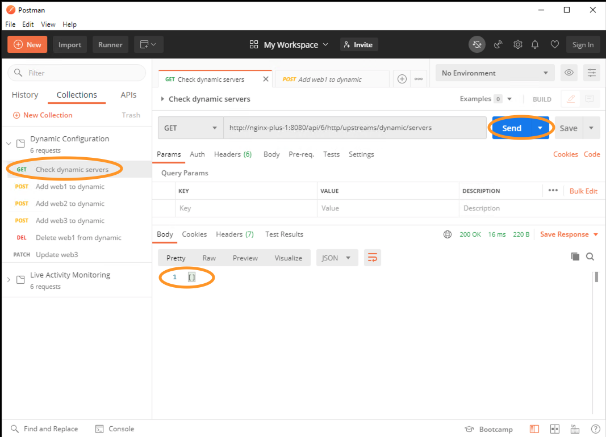   
    

8. Lets now add a two servers, `web1` (`10.1.1.5:80`) and `web2` (`10.1.1.6:80`) to the `dynamic` upstream group using the API.

    Open `Add web1 to dynamic` and `Add web2 to dynamic` requests and run them as shown below.

    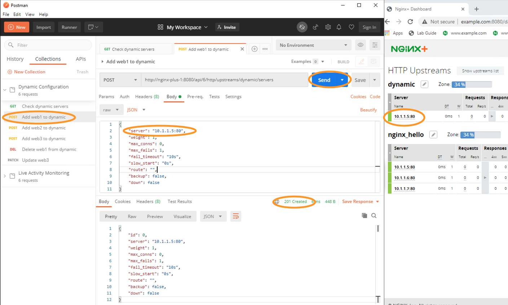
    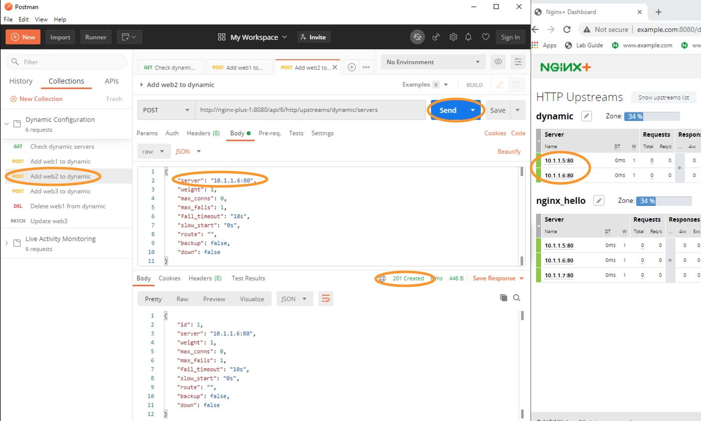

9.  Lets now add `web3` (`10.1.1.7:80`), **marked as down**, to the `dynamic` upstream group using the API

    Using `Postman` tool:

    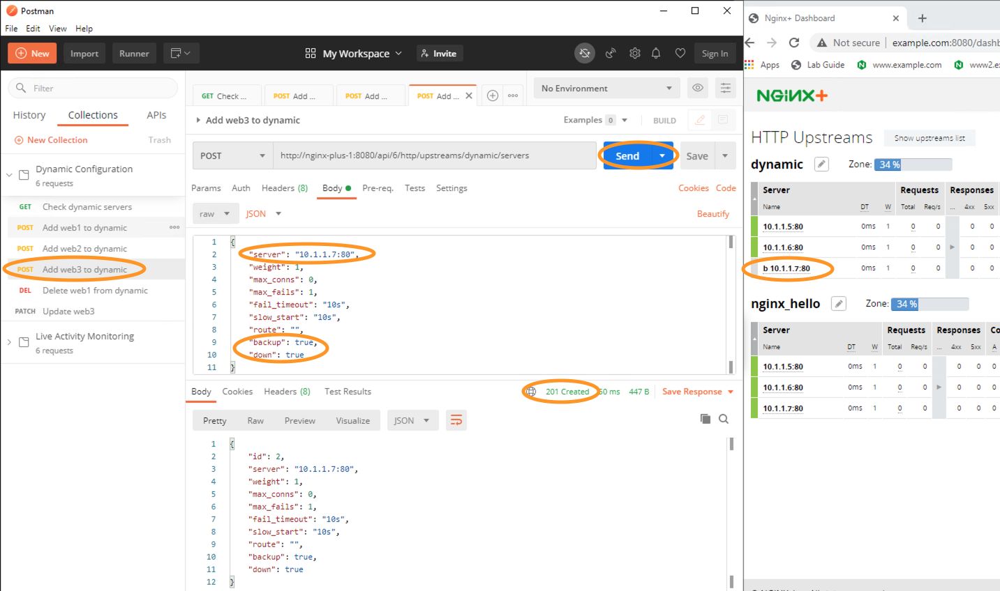

10. Once again list out the servers in our upstream, `dynamic`, and view the changes made

    Using `Postman` tool:

    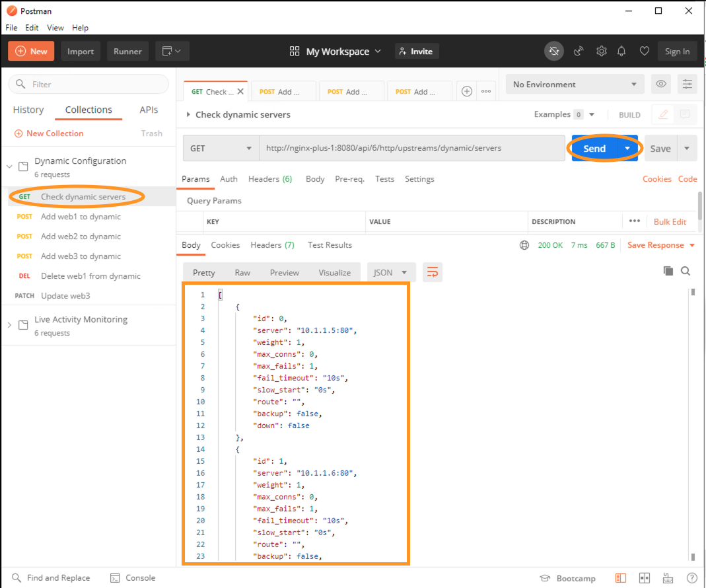

11. We can also confirm that the state file has been updated:

    ```bash
    $> cat /var/lib/nginx/state/servers.conf

    $> cat /var/lib/nginx/state/servers.conf

    server 10.1.1.5:80;
    server 10.1.1.6:80;
    server 10.1.1.7:80 slow_start=10s backup down;
    ```

12. It is possible to also remove a server from the upstream group:

    Using `Postman` tool:

    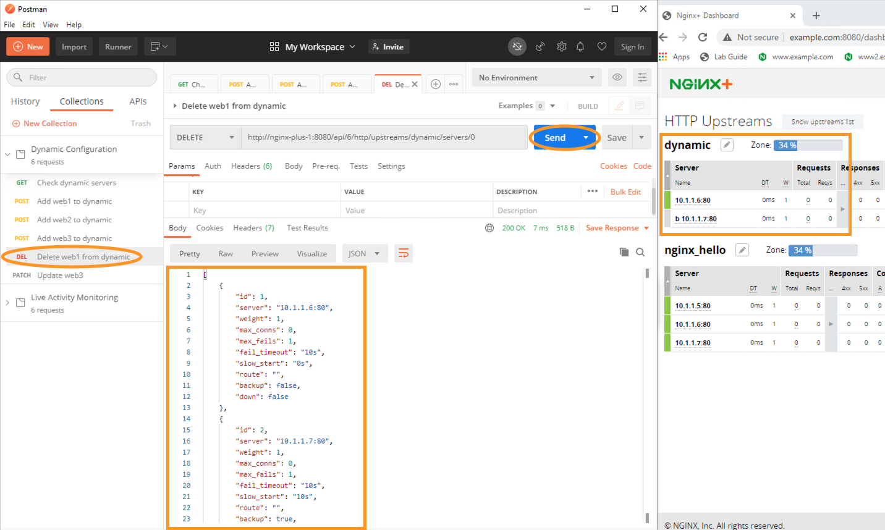

13. To modify our `down` server back to rotation and accept live traffic, we need to change the server parameter from `down: true` to `down: false`. We first must find the server ID:

    Using `Postman` tool:

    Run the  `Check dynamic servers` request to get the list of servers. From the response body note down the `id` value for the block that has the server parameter `down: true` 

    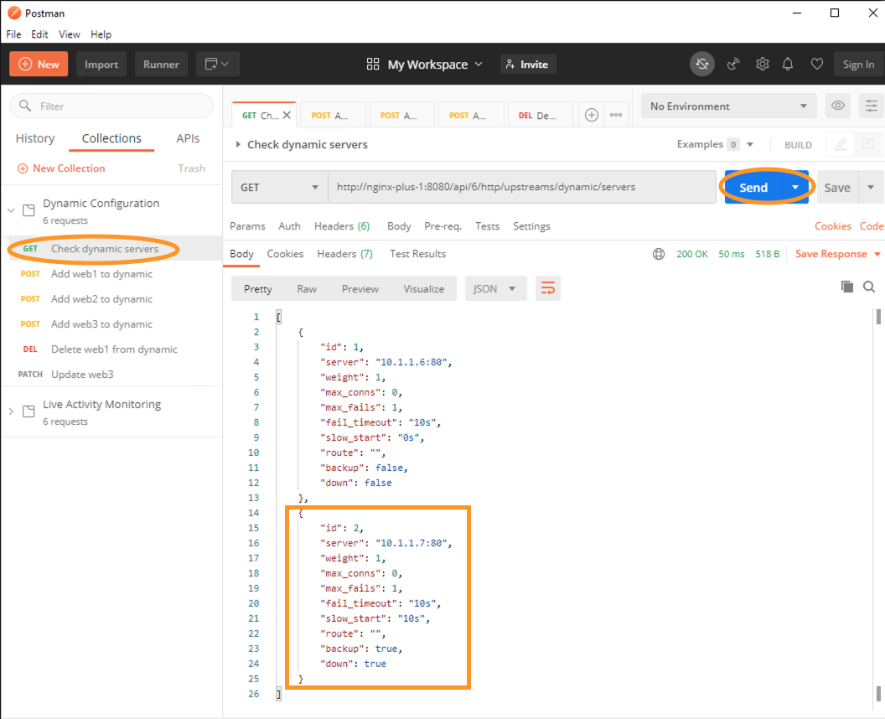

14. Now that we have identified the server id, (e.g. `"id: 2"`) we can modify the `down` parameter:

    Using `Postman` tool:

    

15. Once again, list out servers in our upstream, `dynamic`

    ```bash
    $> curl -s http://nginx-plus-1:8080/api/6/http/upstreams/dynamic/servers | jq
    ```

  

16. We can check the that the `state` file are making our upstream changes
    persistent by reloading NGINX and checking the dashboard and API

    ```bash
    # inspect the state of out state file:
    $> cat /var/lib/nginx/state/servers.conf

    $> server 10.1.1.6:80;
    $> server 10.1.1.7:80 slow_start=10s backup;

    # Reload NGINX
    $> nginx -s reload
    ```

    **Note:** After a NGINX reload, the server `id` is reset to start at `0`:

    ```bash
    # Lastly, list out servers in our upstream, `dynamic` 
    $> curl -s http://nginx-plus-1:8080/api/6/http/upstreams/dynamic/servers | jq
    
      {
        "id": 0,
        "server": "10.1.1.6:80",
        "weight": 1,
        "max_conns": 0,
        "max_fails": 1,
        "fail_timeout": "10s",
        "slow_start": "0s",
        "route": "",
        "backup": false,
        "down": false
      },
      {
        "id": 1,
        "server": "10.1.1.7:80",
        "weight": 1,
        "max_conns": 0,
        "max_fails": 1,
        "fail_timeout": "10s",
        "slow_start": "10s",
        "route": "",
        "backup": true,
        "down": false
      }
    ]
    ```

### Optional: Dynamic Configuration of an Upstream using the NGINX API using cURL

In this section, we will use `curl` to interact with the NGINX API. 

1. In the `WORKSPACE` folder found on the desktop, open `NGINX-PLUS-1` in Visual
   Studio Code (VSCode)

  

2. In the VSCode, open a a **terminal window**, using `View > Terminal menu`
   command. You will now be able to both run NGINX commands and edit NGINX Plus
   configuration files via the VSCode Console and terminal. (SSH access via
   Putty is also available as a SSH remote terminal access option.)

    

3. Now inspect the `/etc/nginx/conf.d/upstreams.conf` file. Note the following:

    * The `zone` directive configures a zone in the shared memory and sets the
      zone name and size. The configuration of the server group is kept in this
      zone, so all worker processes use the same configuration. In our example,
      the `zone` is also named `dynamic` and is `64k` megabyte in size.
    * The `state` directive configures Persistence of Dynamic Configuration by
      writing the state information to a file that persists during a reload. The
      recommended path for Linux distributions is `/var/lib/nginx/state/`

      ```nginx
      # /etc/nginx/conf.d/upstream.conf 

      upstream dynamic {
          # Specify a file that keeps the state of the dynamically configurable group:
          state /var/lib/nginx/state/servers.conf;

          zone dynamic 64k;

          # Including keep alive connections are bonus points
          keepalive 32;
      }
      ```

4. In the Terminal window, on the NGINX plus instance, ensure that the `state`
   file is at a empty state for this demo. Delete the file (if exists), then
   create an empty file:

    ```bash
    $> rm /var/lib/nginx/state/servers.conf
    rm: cannot remove '/var/lib/nginx/state/servers.conf': No such file or directory
    ```

    Then run:

    ```bash
    $> touch /var/lib/nginx/state/servers.conf
    ```

5. In a Web Browser, open the NGINX dashboard on
   [`http://www.example.com:8080/dashboard.html`](http://www.example.com:8080/dashboard.html).
   There is a bookmark in the Chrome Web Browser. Navigate to `HTTP Upstreams`,
   and note that the `dynamic` is empty:

  

6. In the Terminal window, we can also confirm the empty state of our upstream,
   `dynamic`, using our a `curl` command to retrieve this information from the
   NGINX API

  ```bash
  $> curl -s http://nginx-plus-1:8080/api/6/http/upstreams/dynamic/servers | jq

  []
  ```

7. Lets now add a two servers, `web1` (`10.1.1.5:80`) and `web2` (`10.1.1.6:80`)
   to the `dynamic` upstream group using the API

    ```bash
    # Add web1 - 10.1.1.5:80
    $> curl -s -X \
    POST http://nginx-plus-1:8080/api/6/http/upstreams/dynamic/servers \
    -H 'Content-Type: text/json; charset=utf-8' \
    -d '{
      "server": "10.1.1.5:80",
      "weight": 1,
      "max_conns": 0,
      "max_fails": 1,
      "fail_timeout": "10s",
      "slow_start": "0s",
      "route": "",
      "backup": false,
      "down": false
    }'

    # Add web2 - 10.1.1.6:80
    $> curl -s -X \
    POST http://nginx-plus-1:8080/api/6/http/upstreams/dynamic/servers \
    -H 'Content-Type: text/json; charset=utf-8' \
    -d '{
      "server": "10.1.1.6:80",
      "weight": 1,
      "max_conns": 0,
      "max_fails": 1,
      "fail_timeout": "10s",
      "slow_start": "0s",
      "route": "",
      "backup": false,
      "down": false
    }'
    ```

    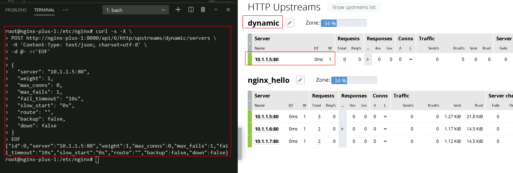

    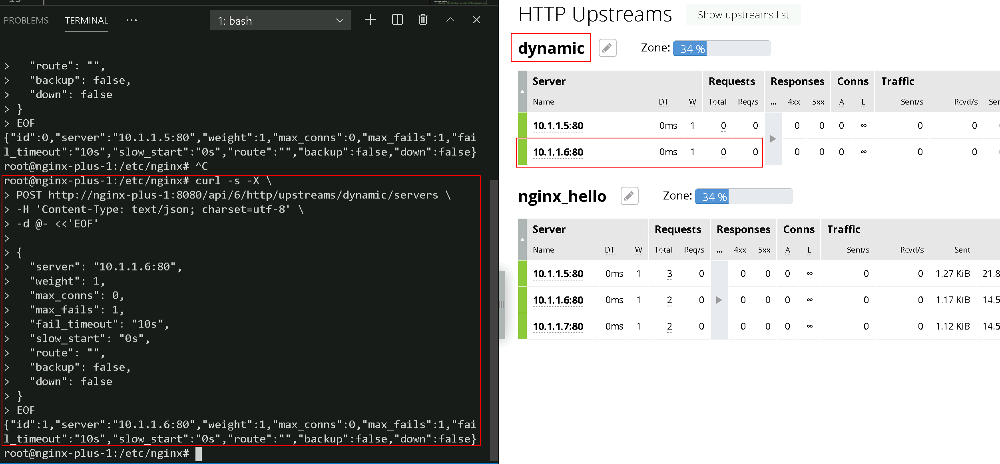

8. Lets now add `web3` (`10.1.1.7:80`), **marked as down**, to the `dynamic`
   upstream group using the API

      ```bash
    # Add web3 - 10.1.1.7:80
    $> curl -s -X \
    POST http://nginx-plus-1:8080/api/6/http/upstreams/dynamic/servers \
    -H 'Content-Type: text/json; charset=utf-8' \
    -d '{
      "server": "10.1.1.7:80",
      "weight": 1,
      "max_conns": 0,
      "max_fails": 1,
      "fail_timeout": "10s",
      "slow_start": "10s",
      "route": "",
      "backup": true,
      "down": true
    }'
    ```                   

    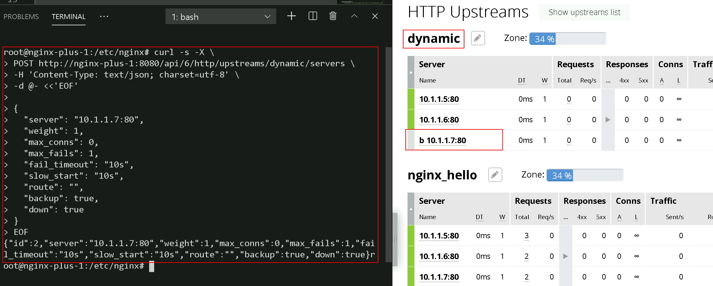

9. Once again list out the servers in our upstream, `dynamic`, and view the
   changes made

    ```json
    curl -s http://nginx-plus-1:8080/api/6/http/upstreams/dynamic/servers | jq
    [
      {
        "id": 0,
        "server": "10.1.1.5:80",
        "weight": 1,
        "max_conns": 0,
        "max_fails": 1,
        "fail_timeout": "10s",
        "slow_start": "0s",
        "route": "",
        "backup": false,
        "down": false
      },
      {
        "id": 1,
        "server": "10.1.1.6:80",
        "weight": 1,
        "max_conns": 0,
        "max_fails": 1,
        "fail_timeout": "10s",
        "slow_start": "0s",
        "route": "",
        "backup": false,
        "down": false
      },
      {
        "id": 2,
        "server": "10.1.1.7:80",
        "weight": 1,
        "max_conns": 0,
        "max_fails": 1,
        "fail_timeout": "10s",
        "slow_start": "10s",
        "route": "",
        "backup": true,
        "down": true
      }
    ]
    ```

8. We can also confirm that the state file has been updated:

    ```bash
    $> cat /var/lib/nginx/state/servers.conf

    $> cat /var/lib/nginx/state/servers.conf

    server 10.1.1.5:80;
    server 10.1.1.6:80;
    server 10.1.1.7:80 slow_start=10s backup down;
    ```

9. It is possible to also remove a server from the upstream group:

    ```bash
    $> curl -X DELETE -s http://nginx-plus-1:8080/api/6/http/upstreams/dynamic/servers/0 | jq
    [
      {
        "id": 1,
        "server": "10.1.1.6:80",
        "weight": 1,
        "max_conns": 0,
        "max_fails": 1,
        "fail_timeout": "10s",
        "slow_start": "0s",
        "route": "",
        "backup": false,
        "down": false
      },
      {
        "id": 2,
        "server": "10.1.1.7:80",
        "weight": 1,
        "max_conns": 0,
        "max_fails": 1,
        "fail_timeout": "10s",
        "slow_start": "10s",
        "route": "",
        "backup": true,
        "down": true
      }
    ]
    ```

    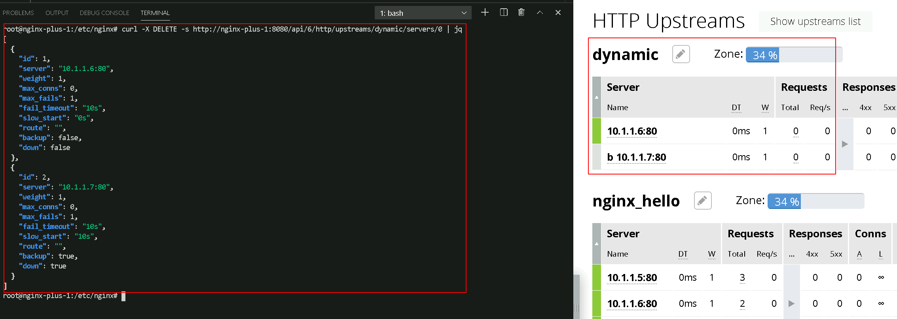

10. To modify our `down` server back to rotation and accept live traffic, we
    need to change the server parameter from `down: true` to `down: false`. We
    first must find the server ID:

    ```bash
    # Find the ID of the down server i.e '"down": true', i.e. live
    $> curl -s http://nginx-plus-1:8080/api/6/http/upstreams/dynamic/servers | jq '.[]  | select(.down==true)'

    {
      "id": 2,
      "server": "10.1.1.7:80",
      "weight": 1,
      "max_conns": 0,
      "max_fails": 1,
      "fail_timeout": "10s",
      "slow_start": "10s",
      "route": "",
      "backup": true,
      "down": true
    }

    ```

11. Now that we have identified the server id, (e.g. `"id: 2"`) we can modify
    the `down` parameter:

    ```bash
    # Set server to '"down": false', i.e. live
    $> curl -X PATCH -d '{ "down": false }' -s 'http://nginx-plus-1:8080/api/6/http/upstreams/dynamic/servers/2'

    {"id":2,"server":"10.1.1.7:80","weight":1,"max_conns":0,"max_fails":1,"fail_timeout":"10s","slow_start":"10s","route":"","backup":true,"down":false}
    ```

12. Once again, list out servers in our upstream, `dynamic`

    ```bash
    $> curl -s http://nginx-plus-1:8080/api/6/http/upstreams/dynamic/servers | jq
    ```

  

13. We can check the that the `state` file are making our upstream changes
    persistent by reloading NGINX and checking the dashboard and API

    ```bash
    # inspect the state of out state file:
    $> cat /var/lib/nginx/state/servers.conf

    $> server 10.1.1.6:80;
    $> server 10.1.1.7:80 slow_start=10s backup;

    # Reload NGINX
    $> nginx -s reload
    ```

    **Note:** After a NGINX reload, the server `id` is reset to start at `0`:

    ```bash
    # Lastly, list out servers in our upstream, `dynamic` 
    $> curl -s http://nginx-plus-1:8080/api/6/http/upstreams/dynamic/servers | jq
    
      {
        "id": 0,
        "server": "10.1.1.6:80",
        "weight": 1,
        "max_conns": 0,
        "max_fails": 1,
        "fail_timeout": "10s",
        "slow_start": "0s",
        "route": "",
        "backup": false,
        "down": false
      },
      {
        "id": 1,
        "server": "10.1.1.7:80",
        "weight": 1,
        "max_conns": 0,
        "max_fails": 1,
        "fail_timeout": "10s",
        "slow_start": "10s",
        "route": "",
        "backup": true,
        "down": false
      }
    ]