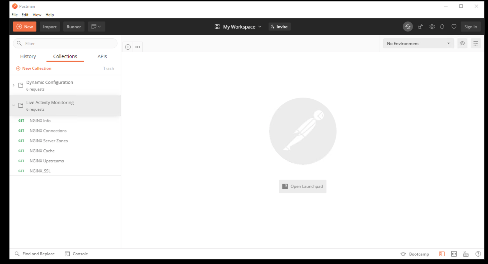
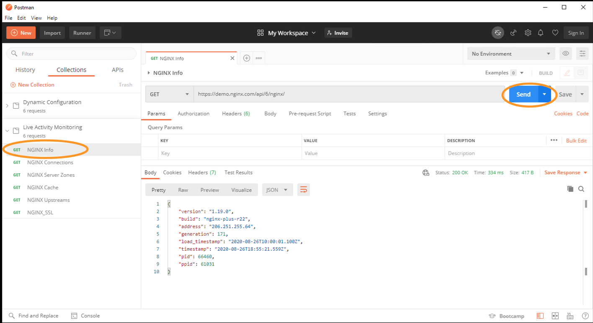
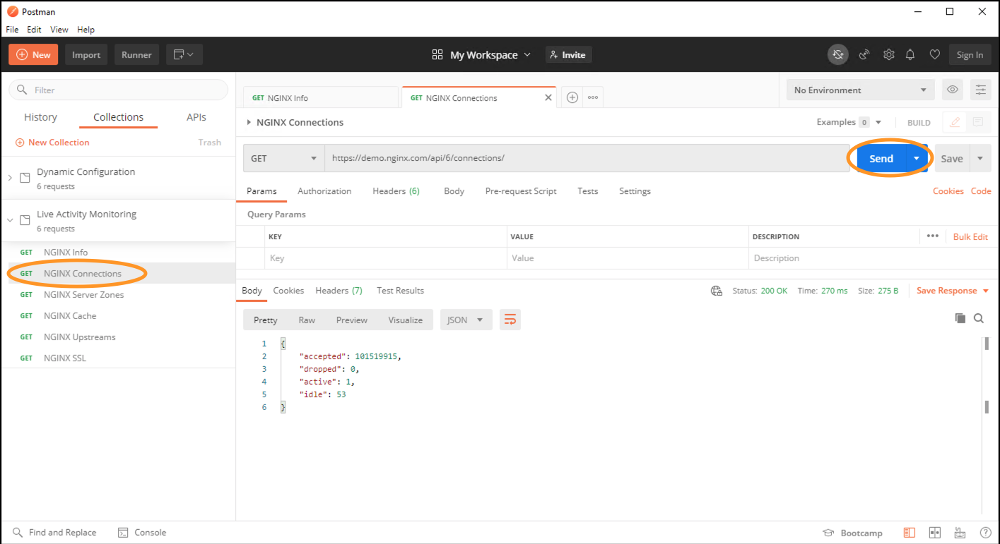
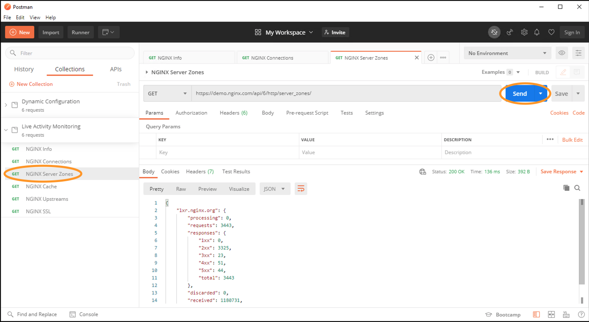
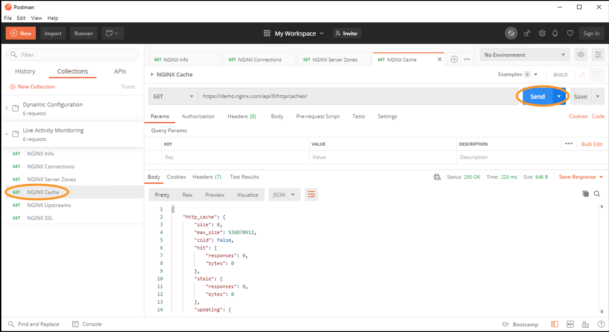
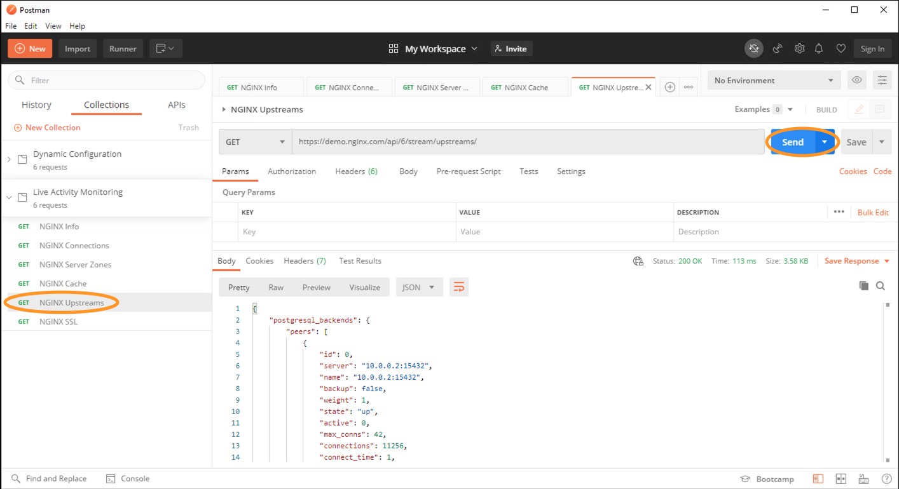
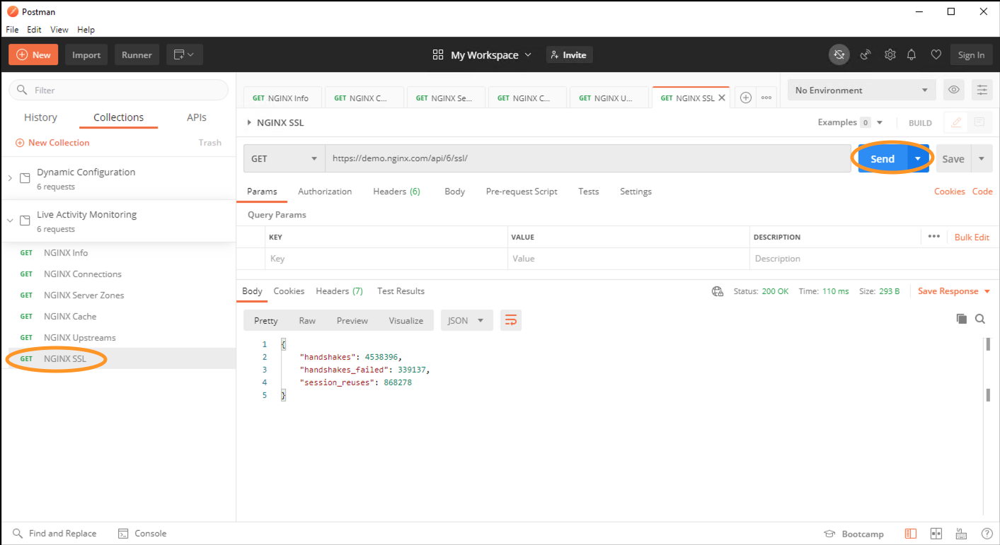
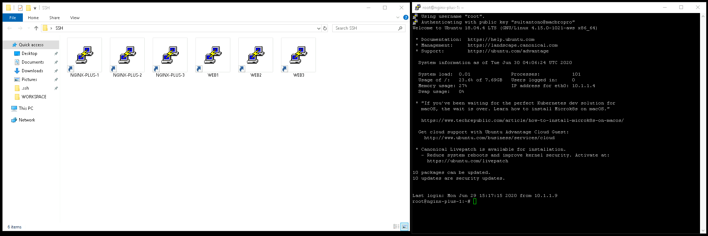

# NGINX Plus API Live Monitoring

## Introduction

The [NGINX Plus API](https://www.nginx.com/products/nginx/live-activity-monitoring/) supports other features in addition to live activity monitoring, including dynamic configuration of upstream server groups and key‑value stores. 

Live examples:​
 * A [sample configuration](https://gist.github.com/nginx-gists/a51341a11ff1cf4e94ac359b67f1c4ae) file for the NGINX Plus API
 * Example live dashboard: [demo.nginx.com](https://demo.nginx.com)
 * Raw JSON output: [demo.nginx.com/api​](https://demo.nginx.com/api)
 * Swagger-UI: [demo.nginx.com/swagger-ui](https://demo.nginx.com/swagger-ui/)
 * API YAML: [demo.nginx.com/swagger-ui](https://demo.nginx.com/swagger-ui/nginx_api.yaml)

## Learning Objectives 

By the end of the lab you will be able to: 

 * Use [demo.nginx.com](https://demo.nginx.com) for demo purposes
 * Use the NGINX Plus API to read live monitoring metrics on NGINX Plus
 * Interact with the NGINX Plus API using both [Postman](https://www.postman.com) and [`cURL`](https://curl.haxx.se)

## Exercise 1: Explore the Live Activity Monitoring JSON Feed​ from demo.nginx.com using Postman:

When you access the API, NGINX Plus returns a JSON‑formatted document containing
the current statistics. You can request complete statistics at
`/api/[api-version]/`, where `[api-version]` is the version number of the NGINX
Plus API.

Lets look at the Live Activity Monitoring JSON Feed​ in detail.

In this section, we will use `Postman` to interact with the NGINX API. In the Optional section below, we can reproduce the same steps using `curl`


1. Open `Postman` tool found on the desktop

   

2. Within the `Live Activity Monitoring` collection, open `NGINX Info` request and then click on `Send` button. <br>`/api/api-version/nginx/` is used to retrieve basic version, uptime, and identification information​.
   
    

3. Next open `NGINX Connections` request and then click on `Send` button. <br>`/api/api-version/connections/` is used to retrieve total active and idle connections​.
   
    

4. Open `NGINX Server Zones` request and then click on `Send` button. <br>`/api/api-version/http/server_zones/` is used to retrieve request and response counts for each HTTP status zone.

    

5. Open `NGINX Cache` request and then click on `Send` button. <br>`/api/api-version/http/caches/` is used to retrieve instrumentation for each named cache zone.

    

6. Open `NGINX Upstreams` request and then click on `Send` button. <br>`/api/api-version/stream/upstreams/` is used to retrieve request and response counts, response time, health‑check status, and uptime statistics per server in each TCP/UDP upstream group.

    

7. Open `NGINX SSL` request and then click on `Send` button. <br>`/api/api-version/ssl/` is used to retrieve SSL/TLS statistics.
   
    

### Optional: Explore the Live Activity Monitoring JSON Feed​ from demo.nginx.com using cURL:

In this section, we will use `curl` to interact with the NGINX API. 

1. In the `SSH` folder found on the desktop, open any Linux SSH session found on
   here, e.g. `NGINX-PLUS-1`

    

2. In the Terminal Window, using `curl` and `jq` for JSON formatting, make a
   request to the API endpoint, `/api/api-version/nginx/` to retrieve basic
   version, uptime, and identification information​

    ```bash
    $> curl -s https://demo.nginx.com/api/8/nginx/ | jq

    {
      "version": "1.25.1",
      "build": "nginx-plus-r30-p1",
      "address": "18.193.151.235",
      "generation": 1,
      "load_timestamp": "2023-10-13T18:09:35.308Z",
      "timestamp": "2023-11-13T22:33:09.230Z",
      "pid": 970577,
      "ppid": 970575
    }
    ```

3. Using `curl` and `jq`, make a request to the API endpoint,
   `/api/api-version/connections/` to retrieve total active and idle
   connections​

    ```bash
    $> curl -s https://demo.nginx.com/api/8/connections/ | jq

    {
      "accepted": 59007844,
      "dropped": 6715,
      "active": 3,
      "idle": 133
    }
    ```

4. Using `curl` and `jq`, make a request to the API endpoint,
   `/api/api-version/http/server_zones/` to retrieve request and response counts
   for each HTTP status zone​

  ```bash
  $> curl -s https://demo.nginx.com/api/8/http/server_zones/ | jq

  {
    "hg.nginx.org": {
      "processing": 0,
      "requests": 6281910,
      "responses": {
        "1xx": 0,
        "2xx": 6193596,
        "3xx": 5690,
        "4xx": 82560,
        "5xx": 0,
        "codes": {
          "200": 6193476,
          "206": 120,
          "304": 5690,
          "404": 81922,
          "405": 628,
          "416": 10
        },
        "total": 6281846
      },
      "discarded": 64,
      "received": 3555591945,
      "sent": 751214389964,
      "ssl": {
        "handshakes": 6275560,
        "session_reuses": 6222980,
        "handshakes_failed": 852,
        "no_common_protocol": 0,
        "no_common_cipher": 0,
        "handshake_timeout": 0,
        "peer_rejected_cert": 0,
        "verify_failures": {
          "no_cert": 0,
          "expired_cert": 0,
          "revoked_cert": 0,
          "other": 0
        }
      }
    },

    # Trimmed ...
  }
  ```

5. Using `curl` and `jq`, make a request to the API endpoint,
   `/api/api-version/http/caches/` to retrieve instrumentation for each named
   cache zone

  ```bash
  $> curl -s https://demo.nginx.com/api/8/http/caches/ | jq

  {
    "http_cache": {
      "size": 0,
      "max_size": 536870912,
      "cold": false,
      "hit": {
        "responses": 0,
        "bytes": 0
      },
      "stale": {
        "responses": 0,
        "bytes": 0
      },
      "updating": {
        "responses": 0,
        "bytes": 0
      },
      "revalidated": {
        "responses": 0,
        "bytes": 0
      },
      "miss": {
        "responses": 0,
        "bytes": 0,
        "responses_written": 0,
        "bytes_written": 0
      },
      "expired": {
        "responses": 0,
        "bytes": 0,
        "responses_written": 0,
        "bytes_written": 0
      },
      "bypass": {
        "responses": 0,
        "bytes": 0,
        "responses_written": 0,
        "bytes_written": 0
      }
    }
  }

  ```

6. Using `curl` and `jq`, make a request to the API endpoint,
   `/api/api-version/stream/upstreams/` to retrieve request and response counts,
   response time, health‑check status, and uptime statistics per server in each
   TCP/UDP upstream group

    ```bash
    $> curl -s https://demo.nginx.com/api/8/stream/upstreams/ | jq

    {
      "postgresql_backends": {
        "peers": [
          {
            "id": 0,
            "server": "10.0.0.2:15432",
            "name": "10.0.0.2:15432",
            "backup": false,
            "weight": 1,
            "state": "up",
            "active": 0,
            "max_conns": 42,
            "connections": 9250,
            "sent": 952750,
            "received": 1850000,
            "fails": 0,
            "unavail": 0,
            "health_checks": {
              "checks": 5564,
              "fails": 0,
              "unhealthy": 0,
              "last_passed": true
            },
            "downtime": 0,
          },
          {
            "id": 1,
            "server": "10.0.0.2:15433",
            "name": "10.0.0.2:15433",
            "backup": false,
            "weight": 1,
            "state": "up",
            "active": 0,
            "connections": 9250,

            # Trimmed ...
    ```

7. Using `curl` and `jq`, make a request to the API endpoint,
   `/api/api-version/ssl/` to retrieve SSL/TLS statistics

  ```bash
  $> curl -s https://demo.nginx.com/api/8/ssl/ | jq

  {
    "handshakes": 96554275,
    "session_reuses": 82250779,
    "handshakes_failed": 787763,
    "no_common_protocol": 20782,
    "no_common_cipher": 141,
    "handshake_timeout": 1518,
    "peer_rejected_cert": 0,
    "verify_failures": {
      "no_cert": 0,
      "expired_cert": 0,
      "revoked_cert": 0,
      "hostname_mismatch": 0,
      "other": 0
    }
  }
  ```