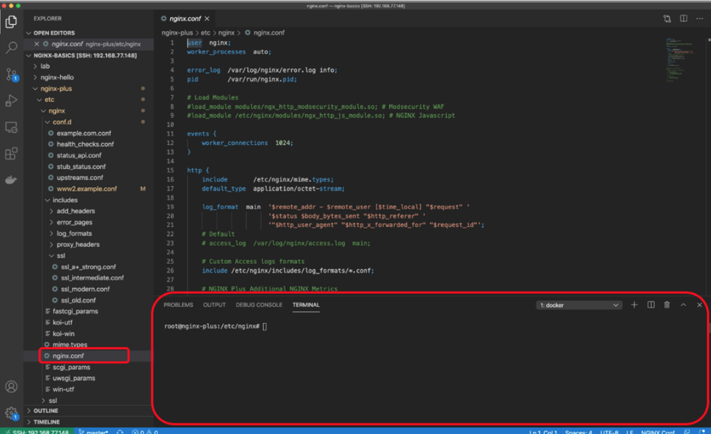

# NGINX Plus HTTP Load balancing

## Introduction

Both NGINX Open Source and NGINX Plus can load balance HTTP, TCP, and UDP traffic. NGINX Plus extends NGINX Open Source 
with enterprise‑grade load balancing that includes session persistence, active health checks, dynamic reconfiguration of 
load‑balanced server groups without a server restart, and additional metrics.

**References:** 
 * [NGINX Command Line](https://www.nginx.com/resources/wiki/start/topics/tutorials/commandline/)
 * [High-Performance Load Balancing](https://www.nginx.com/products/nginx/load-balancing/)
 * [HTTP Load Balancing](https://docs.nginx.com/nginx/admin-guide/load-balancer/http-load-balancer/)

## Learning Objectives 

By the end of the lab you will be able to: 

 * Invoke NGINX and common options from from the command line
 * Enable NGINX Plus as an HTTP load balancer 
 * Enable NGINX Plus as an HTTPS load balancer 
 * TLS Best practices 

## Exercise 1: NGINX Plus command line basics

In this exercise, you will review configure NGINX Plus as a basic load balancer and test/verify configured functionality.   

1. In the `WORKSPACE` folder found on the desktop, open `NGINX-PLUS-31code-workspace` in Visual Studio Code (VSCode)


You will now be able to both run NGINX commands and edit NGINX Plus configuration files via the VS Code Console and 
terminal. SSH access via Putty is also available as a terminal option. 



2. In the TERMINAL window, run the follow NGINX commands: 

```bash
#  Print help for command-line parameters.
nginx -h 
# Test the configuration file: nginx checks the configuration for correct syntax, 
# and then tries to open files referred in the configuration.
nginx -t 
# same as -t, but additionally dump configuration files to standard output
nginx -T 
# print nginx version
nginx -v
# print nginx version, compiler version, and configure parameters.
nginx -V 
send a signal to the master process. The argument signal can be one of:
# stop — shut down quickly
# quit — shut down gracefully
# reload — reload configuration, start the new worker process with a new
#          configuration, gracefully shut down old worker processes.
# reopen — reopen log files
nginx -s reload 
```

## Exercise 2: Inspect NGINX Plus modules

1. Select the `nginx.conf` file in the VSCode Explorer section. 

 * Note the `“# Load Modules”` entry in the main context. 

2. In the terminal window run the following commands to see which Dynamic modules are installed: 

```bash
cd /etc/nginx/modules  
ls -al 
```

## Exercise 3: Inspect the nginx configuration and rewrite logs

1. Once again, inspect the `nginx.conf` file. Note the following:

 * `include /etc/nginx/conf.d/*.conf` statement for inclusion of further NGINX Plus configuration files.
 * Note the commented out `# TCP/UDP proxy and load balancing block` This is an example of using the “stream” context 
   for TCP and UDP load balancing. 
  
2. Select the `example.com.conf` file in the VSCode Explorer section. Specifically note the following entries in the 
   server block: 

 * `server_name www.example.com “"`, that will match `www.example.com`
 * `location /`, that will match all or any uri 
 * `proxy_pass http://nginx_hello`, to proxy request to the upstream group labeled `nginx_hello` (defined in `upstreams.conf`) 
 * `rewrite_log on` directive, and the `"301 MOVED PERMANENTLY"` line . This allows for logging all rewrites to the error log. 


```nginx
# www.example.com HTTP
server {
    listen 80 default_server;
    server_name www.example.com "";

    location / {
        
        proxy_pass http://nginx_hello;
    }

    # Enabling rewrite logging is bonus points
    # Enables logging of ngx_http_rewrite_module module directives 
    # processing results into the error_log at the notice level
    rewrite_log on;
    
    # 301 MOVED PERMANENTLY
    location = /old-url { return 301 new-url; } 

    # etc..

}

```

5. Open another Terminal in VSCode by selecting the **split terminal** icon on the right.
   Alternatively, if you want to open a SSH session in putty, you can open another terminal into the `nginx-plus-1` host. 


 
6. In the terminal shell, run the following commands:

 a. On one terminal shell, `tail` the error logs for `www.example.com`: 

```bash
cd /var/log/nginx 
tail -f www.example.com_error.log 
```

 b. In the other terminal shell, run the following `curl` command: 
 
```bash
curl http://localhost/old-url 
```

Note the entry in the `www.example.com_error.log` printed in the first terminal

## Exercise 4: HTTP Load Balancing

1. In the VS ode Explorer select the `upstreams.conf` file. Observe the following configuration entries to the 
   `upstream nginx_hello` block: 

```nginx
# nginx-hello servers 
upstream nginx_hello {

    least_time header; #header|last_byte 

    zone nginx_hello 64k;
    server web1:80;
    server web2:80;
    server web3:80; 

    # keep alive connections
    keepalive 32;

}
```

2. In a Web Browser, open [http://www.example.com](http://www.example.com)

   You should see something similar to the web page below 
   Reload the page several times and ensure that the `Server Name:` changes from `web1`, to `web2` and `web3` in a load 
   balancing fashion. 


## Exercise 5: HTTPS Load Balancing

1. In VSCode Explorer open `www2.example.conf` and observe the following configuration entries: 

   * `server_name www2.example.com`, to listen on all `www2.example.com` requests
   * `return 301 https://$host$request_uri`, to perform a `HTTP 301` redirect to HTTPS service
   * `ssl_certificate` and `ssl_certificate_key` directives that specific the PEM files used for TLS

```nginx
# www2.example.com HTTP Redirect to HTTPS
server {
    listen 80;
    server_name www2.example.com;
    return 301 https://$host$request_uri;
}
# www2.example.com HTTPS
server {
    listen 443 ssl default_server;
    server_name www2.example.com;

    # Minimum SSL Configuration
    ssl_certificate /etc/ssl/example.com.crt;
    ssl_certificate_key /etc/ssl/example.com.key;

    # etc...

}
```

2. In your lab browser, open [https://www2.example.com](https://www2.example.com)

   You should see something similar to the above web page below. 

   You should see something similar to the web page below 
   Reload the page several times and ensure that the `Server Name:` changes from `web1`, to `web2` and `web3` in a load 
   balancing fashion. 

