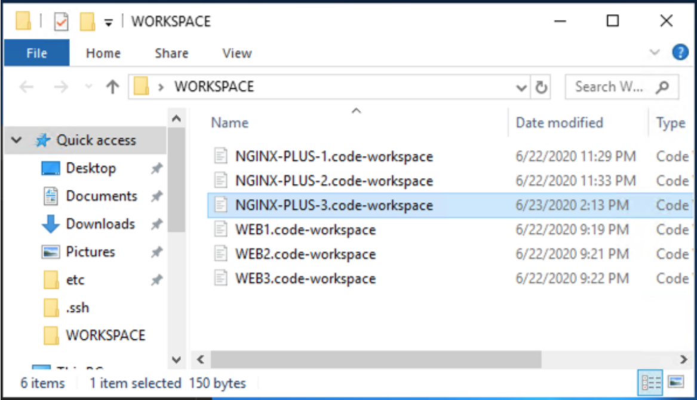

# Installing NGINX Plus 

## Introduction

NGINX Plus is supported on Amazon Linux, CentOS, Debian, FreeBSD, Oracle Linux, Red Hat Enterprise Linux (RHEL), SUSE Linux Enterprise Server (SLES), and Ubuntu.

For Sizing guidance for Deploying NGINX Plus, see [Sizing Guide for Deploying NGINX Plus on Bare Metal Servers](https://www.nginx.com/resources/datasheets/nginx-plus-sizing-guide/)

**Prerequisites**
 * An NGINX Plus subscription (purchased or trial)
 * A supported operating system
 * root privilege
 * Your credentials to the NGINX Plus Customer Portal, provided by email from NGINX, Inc.
 * Your NGINX Plus certificate and public key (`nginx-repo.crt` and `nginx-repo.key` files), provided by email from NGINX, Inc.

**References:** 
 * [Installing NGINX Plus](https://docs.nginx.com/nginx/admin-guide/installing-nginx/installing-nginx-plus/)

## Learning Objectives 

By the end of the lab you will be able to: 

 * Install NGINX Plus 
 * Install NGINX Plus Dynamic Module – GeoIP2 
 * Verify Installation 

## Exercise 1: Instal NGINX Plus 

1. In the `WORKSPACE` folder found on the desktop, open `NGINX-PLUS-3.code-workspace` in Visual Studio Code (VSCode)



2. In the VS Code Terminal window, execute the following NGINX Plus installation process


```bash
# Confirm you are root
whoami
root

# Run installation commands
cd /root 
mkdir -p /etc/ssl/nginx 
cp nginx-repo.* /etc/ssl/nginx 
wget http://nginx.org/keys/nginx_signing.key && sudo apt-key add nginx_signing.key 
apt-get install apt-transport-https lsb-release ca-certificates 
printf "deb https://plus-pkgs.nginx.com/ubuntu `lsb_release -cs` nginx-plus\n" | sudo tee /etc/apt/sources.list.d/nginx-plus.list 
wget -P /etc/apt/apt.conf.d https://cs.nginx.com/static/files/90nginx 
apt-get update 
apt-get install nginx-plus 
```

3. Verify the version of NGINX Plus that was installed: 

```bash
nginx -v 
```

4. Install the NGINX Plus GeoIP2 Dynamic Module

```bash
apt-get install nginx-plus-module-geoip2 

Reading package lists... Done 
Building dependency tree        
Reading state information... Done 

The following additional packages will be installed: 

  libmaxminddb0 

Suggested packages: 

  mmdb-bin 

The following NEW packages will be installed: 

  libmaxminddb0 nginx-plus-module-geoip2 

0 upgraded, 2 newly installed, 0 to remove and 9 not upgraded. 
Need to get 37.6 kB of archives. 
After this operation, 138 kB of additional disk space will be used. 
Do you want to continue? [Y/n] Y 
Get:1 http://us-west-2.ec2.archive.ubuntu.com/ubuntu bionic/universe amd64 libmaxminddb0 amd64 1.3.1-1 [25.6 kB] 
Get:2 https://plus-pkgs.nginx.com/ubuntu bionic/nginx-plus amd64 nginx-plus-module-geoip2 amd64 22+3.3-1~bionic [12.0 kB] 
Fetched 37.6 kB in 1s (54.7 kB/s)                      
Selecting previously unselected package libmaxminddb0:amd64. 
(Reading database ... 56711 files and directories currently installed.) 
Preparing to unpack .../libmaxminddb0_1.3.1-1_amd64.deb ... 
Unpacking libmaxminddb0:amd64 (1.3.1-1) ... 
Selecting previously unselected package nginx-plus-module-geoip2. 
Preparing to unpack .../nginx-plus-module-geoip2_22+3.3-1~bionic_amd64.deb ... 
Unpacking nginx-plus-module-geoip2 (22+3.3-1~bionic) ... 
Setting up libmaxminddb0:amd64 (1.3.1-1) ... 
Setting up nginx-plus-module-geoip2 (22+3.3-1~bionic) ... 

---------------------------------------------------------------------- 

The 3rd-party GeoIP2 dynamic modules for NGINX Plus have been installed. 
To enable these modules, add the following to /etc/nginx/nginx.conf 
and reload nginx: 

    load_module modules/ngx_http_geoip2_module.so; 
    load_module modules/ngx_stream_geoip2_module.so; 

Please refer to the module documentation for further details: 
https://github.com/leev/ngx_http_geoip2_module 

---------------------------------------------------------------------- 
Processing triggers for man-db (2.8.3-2ubuntu0.1) ... 
Processing triggers for libc-bin (2.27-3ubuntu1) ... 
```

5. Start NGINX Plus
 
```bash
systemctl start nginx 
```

6.  Verify that NGINX Plus has started

```
ps -eaf | grep nginx 

root      5532     1  0 19:35 ?        00:00:00 nginx: master process /usr/sbin/nginx -c /etc/nginx/nginx.conf 
nginx     5534  5532  0 19:35 ?        00:00:00 nginx: worker process 
root      5541  4062  0 19:35 pts/1    00:00:00 grep --color=auto nginx 
```

7. Test the NGINX Plus instance in your browser. Open **Google Chrome** from your Desktop and enter the following URL, 
   [http://nginx-plus-3](http://nginx-plus-3)

